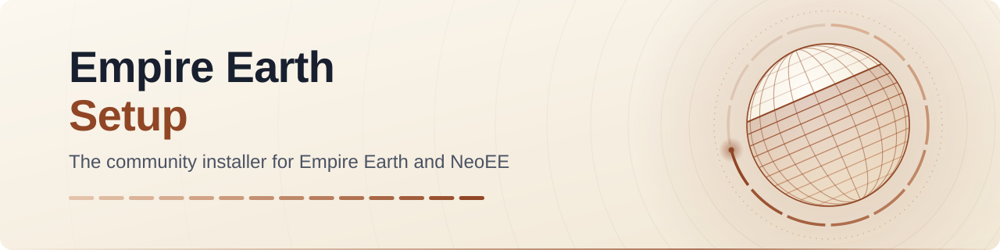

<picture>
  <source media="(prefers-color-scheme: dark)" srcset=".github/assets/banner-dark.svg">
  <source media="(prefers-color-scheme: light)" srcset=".github/assets/banner-light.svg">
  
</picture>

# Empire Earth Community Setup

**The community installer for Empire Earth, The Art of Conquest and Neo Empire Earth:** the EE and NeoEE setups with
verified downloads, statistics only with consent, safer updates and a hand-off to the Empire Earth Launcher, plus the
suite installer "Empire Earth Community" that sets up both games and the launcher in one run. Written in Inno Setup 6.2.2
and Pascal Script, with automated checks and tests.

[](https://github.com/DritteRippe/Empire-Earth-Setup/releases/latest)
[](https://github.com/DritteRippe/Empire-Earth-Setup/actions/workflows/build.yml?query=branch%3Amain)
[](LICENSE)
[](#compatibility-and-graphics-options)
[](#requirements)

**[Download](#download)** · **[Quick start](#quick-start)** · **[Documentation](#documentation)** ·
**[Contributing](CONTRIBUTING.md)** · **[Security](SECURITY.md)**

> [!TIP]
> **Just want to play?** You do not need anything from this repository. The package **Empire Earth Community** installs
> both games, the community fixes and the Empire Earth Launcher in one go:
> **[download the latest release](https://github.com/DritteRippe/Empire-Earth-Community/releases/latest)**.

## At a glance

- 📦 **One setup for everything:** the suite installer "Empire Earth Community" installs Empire Earth with The Art of
  Conquest, Neo Empire Earth and the launcher in one run and one window. Cancel stops a game setup only before it
  changes its game folder.
- 🔐 **Verified downloads:** HTTPS only, and every online file is pinned by its SHA-256 and size; a file that can
  contain code is never installed without its pin.
- 🛡️ **Careful with administrator rights:** an installation for all users stops before it changes anything if it finds
  links in the folders every user can write to; the uninstaller of the suite deletes your saves only on "Löschen",
  and checks them for links again right before the deletion.
- 🙋 **Statistics only with your consent;** the uninstaller sends nothing.
- 🧩 **Made for the launcher:** every installation leaves an install record, `install.ini` and the integrity manifest
  `files.sha256`, specified in the [contract](docs/CONTRACT.md) shared with the launcher.
- 🖥️ **Windows 7 SP1 to 11**, also on ARM64; dgVoodoo 2.87.5 and a game window up to 1920 x 1200.
- ✅ **Tested on every push:** all four variants compile with Inno Setup 6.2.2, unit tests and policy checks run, and
  15 end-to-end scenarios install, repair, cancel and uninstall the suite on a Windows runner.
- 🌍 **11 languages** in the setups; every new text in English, German and French.

## Quick start

**Players**

1. Download the package [Empire Earth Community](https://github.com/DritteRippe/Empire-Earth-Community/releases/latest),
   unpack it and run **Empire Earth Community Setup** (it asks for administrator rights).
2. Double-click **Empire Earth Community** on the desktop: the launcher opens with the game chosen last.
3. Something wrong? See [Support](#support) and [Known issues](#known-issues), or
   [report a bug](https://github.com/DritteRippe/Empire-Earth-Setup/issues/new/choose).

**Developers** (no game data needed; the checks run on Windows, Linux and macOS, the build needs Windows and
Inno Setup 6.2.2)

```powershell
git clone https://github.com/DritteRippe/Empire-Earth-Setup.git
cd Empire-Earth-Setup
python ci/check_messages.py                                                # messages, BOM and CRLF of the own scripts
python ci/check_suite.py                                                   # the frame of the suite installer
powershell -ExecutionPolicy Bypass -File ci\build.ps1 -Placeholders        # all four variants compile
powershell -ExecutionPolicy Bypass -File ci\run_unit_tests.ps1             # the unit tests
powershell -ExecutionPolicy Bypass -File suite\build_suite.ps1 -Placeholders -RequireVersion 6.2.2
```

The placeholder builds are useless for playing and never distributed. Every check is listed in [Verify](#verify); the
rules for a pull request are in [CONTRIBUTING.md](CONTRIBUTING.md).

## Download

| You want ... | Get it from |
|---|---|
| **To play:** both games, the community fixes and the launcher in one setup | The package **Empire Earth Community**, [latest release](https://github.com/DritteRippe/Empire-Earth-Community/releases/latest). Compare its files with its `SHA256SUMS.txt` before you run the setup ([Checksums of the setups](#checksums-of-the-setups)). |
| The official EE or NeoEE setup 1.7.2 of the upstream project | [empireearth.eu](https://empireearth.eu/download). It is not a build of this fork and replaces an installation of the package in place ([AppIds](#appids)). |
| The source code of a suite release | The tags `suite-vX.Y.Z` of this repository ([releases](https://github.com/DritteRippe/Empire-Earth-Setup/releases)) |

> [!NOTE]
> This repository publishes no installer: the suite embeds the game data, so it ships only inside the package. CI builds
> placeholder setups only.

## Documentation

| Read | For |
|---|---|
| [Why this fork?](#why-this-fork) · [Status](#status) | what this fork changes compared with upstream 1.7.2, and what is released |
| [Support](#support) · [Known issues](#known-issues) | the setup log, missing files, old installations, Windows 7, the mouse, minimizing, `dgVoodoo.conf`, the 2 GB limit |
| [Security](#security) | the link check of an installation for all users, and what it cannot cover |
| [Suite installer](#empire-earth-community-suite-installer) · [Uninstalling the suite](#empire-earth-community-suite-uninstalling) | how the suite installs, cancels and uninstalls, and its release criteria |
| [Building](#building) | assets, AppIds, build switches, the build scripts, checksums, the online files, tests, CI |
| [docs/ARCHITECTURE.md](docs/ARCHITECTURE.md) | the structure of setup v2 and of the suite, data flows, error handling, the testing strategy |
| [docs/adr/](docs/adr/README.md) | the decision records |
| [docs/CONTRACT.md](docs/CONTRACT.md) | the contract with the launcher: what the setup leaves on the computer |
| [docs/TEST-PLAN.de.md](docs/TEST-PLAN.de.md) | the manual tests on real Windows (German) |
| [docs/SERVER-OPERATIONS.md](docs/SERVER-OPERATIONS.md) | what the file servers and the API must provide |
| [docs/RELEASING.md](docs/RELEASING.md) | the release checklist |
| [TRANSLATING.md](TRANSLATING.md) | the languages and how to translate |
| [CHANGELOG.md](CHANGELOG.md) · [THIRD-PARTY-NOTICES.md](THIRD-PARTY-NOTICES.md) | the changes of every version · the third-party components |
| [CONTRIBUTING.md](CONTRIBUTING.md) · [SECURITY.md](SECURITY.md) | how to help · how to report a vulnerability privately |

## Why this fork?
This fork builds on the Empire Earth Community Setup by [EE-modders](https://github.com/EE-modders/Empire-Earth-Setup) and its contributors: the setup, its content and the 1.7.2 release are their work. The branch `main` of this fork rebuilds their Inno Setup 6 script (upstream branch `master`, "Updated to v1.7.2") with verified downloads, statistics only with consent, safer updates, automated tests and documentation. It also adds the suite installer "Empire Earth Community" for both games and the Empire Earth Launcher. There is no new game content ([CHANGELOG.md](CHANGELOG.md), "Suite 1.1.0" and "Unreleased").

| | Upstream 1.7.2 | This fork (`main`) |
|---|---|---|
| Installers | EE and NeoEE setups (regular and portable) | The same four setups, plus the suite installer: both games and, with .NET Framework 4.8, the launcher and the Mod Creator in one run ([details](#empire-earth-community-suite-installer)) |
| Online localized files | Inno Download Plugin 1.6.0 (third-party DLL); downloaded files are not checked against a hash | HTTPS only; every online file is pinned by SHA-256 and size and installed only if it matches. From a server with an invalid certificate (today `files.empireearth.eu`) only pinned files are fetched, without certificate validation, and the hash decides ([details](#online-localized-files), [ADR 0012](docs/adr/0012-pinned-downloads-despite-invalid-certificates.md)) |
| Setup statistics | Sent also when the player declines, and by the uninstaller | Only with consent; the uninstaller sends nothing |
| Player-made random maps | `Data\Random Map Scripts` deleted on every install, repair and update | Only maps the setup installed itself are replaced; the first update from 1.7.2 moves the old folder aside once and says where |
| Files removed by antivirus | Only the NeoEE CD-key tool is checked | Page "Checking the installed files" names every missing file and how to repair ([Support](#support)) |
| Setup log | Only with `/LOG` | Every run writes `%TEMP%\Setup Log <date> #<n>.txt` ([Support](#support)) |
| Checksum of a setup | None | The build writes `<setup>.exe.sha256` next to every setup ([details](#checksums-of-the-setups)) |
| Run as administrator | Set by default for the installing account (all-users installs) | Opt-in task; an update removes the old default value |
| Community certificate (signed builds) | Task preselected for administrators, trusted root store | Unchecked task, trusted publishers only; updates remove the old root entry |
| Update check | HTTPS with HTTP fallback | HTTPS only; opens only https links of the community hosts, in the browser of the non-elevated user |
| Links in `Data` and `Users` | No such check | An all-users installation or update stops before changing anything if it finds links there ([Security](#security)) |
| Windows 7 compatibility values | Windows XP SP3 mode with flags for `EE-AOC.exe` by default | None by default; the flags without the XP mode as an opt-in task ([details](#compatibility-and-graphics-options)) |
| Launcher integration | None | Install record, `install.ini` and the integrity manifest `files.sha256`, specified in [docs/CONTRACT.md](docs/CONTRACT.md) ([details](#empire-earth-launcher)) |
| Tests and CI | None | On every push to `main` and every pull request: build of all four variants with Inno Setup 6.2.2 (placeholder data), unit tests, policy checks and fifteen suite scenarios (S1 to S15) on Windows; a real-data end-to-end workflow on request ([details](#continuous-integration)) |
| Documentation | README, release notes in the script header | [Decision records](docs/adr/README.md), [ARCHITECTURE.md](docs/ARCHITECTURE.md), [CONTRACT.md](docs/CONTRACT.md), [CHANGELOG.md](CHANGELOG.md), [SERVER-OPERATIONS.md](docs/SERVER-OPERATIONS.md), [TRANSLATING.md](TRANSLATING.md), manual [test plan](docs/TEST-PLAN.de.md) (German) |

### Also new
- **Suite installer:** one desktop icon `Empire Earth Community` opens the launcher with the game chosen last (without .NET Framework 4.8 it starts Neo Empire Earth, else Empire Earth). It needs administrator rights and Windows 7 SP1 or later, checks every embedded setup against its SHA-256 and size before running it, and its uninstaller keeps saved games and profiles unless you choose "Delete" ([details](#empire-earth-community-suite-uninstalling)). Its own code never touches `Software\Sierra\CDKeys`; the NeoEE setup it runs registers the CD keys as before. This repository builds the suite only with placeholder products; no suite download is offered here: the package is published on the [release page of Empire Earth Community](https://github.com/DritteRippe/Empire-Earth-Community/releases/latest).
- **Clearer notices when servers fail**, in German and French too: the setup installs its bundled files, names every file it did not install from the download and, if no server can be reached, tells you to run it again later.
- **Hints before installing**, which change nothing: a screen lower than 768 pixels, traces of CD, GOG or old NeoEE installations, EE and NeoEE in one folder ([Support](#support)).
- **German and French** texts for installation types, tasks, components and all new notices, which were English in every language before.
- **For maintainers:** build switches on the ISCC command line instead of edits in the script; `ci/build.ps1` builds and checks all four variants and writes the checksum files; downloads, install state, environment hints, statistics and random maps are separate modules ([ARCHITECTURE.md](docs/ARCHITECTURE.md)); the CI check `ci/check_tls_policy.py` fails if certificate errors are ignored anywhere except for pinned files, or if the suite installer holds any network code at all.

### What changed or was dropped
- The Inno Download Plugin with its detail view and URL-list error dialog; one download page with a stop button replaces it.
- Any retry over `http://`. Windows 7 without updated root certificates or TLS 1.2 cannot use the update check; the game is installed with the bundled files ([Support](#support)).
- An online file that changes on the servers after a build is discarded by that setup until a setup with new pins is released.
- Entries for Windows XP and older (8 compatibility values, 4 of them with the WIN98 mode, and 15 pre-Vista firewall entries) and the Quick Launch task; Inno Setup 6 setups do not start on those systems.
- The default Windows 7 compatibility mode, the default run-as-administrator value and the preselected certificate in the trusted root store (now unchecked tasks, see above).
- An all-users installation or update through a link in `Data` or `Users` stops before changing anything (silent mode: exit code 7) until the link is removed; or install "for me only".
- The statistics no longer count refusals.
- Texts added since 1.7.2 exist in English, German and French only; other languages show them in English until translated ([TRANSLATING.md](TRANSLATING.md)). The suite installer has these three languages only.
- The hidden setup data folder `{app}\<AppId>` is now `_setupdata_EE` or `_setupdata_NeoEE`; updates remove the old one.

### Status
> [!NOTE]
> **Suite 1.1.0** is the current release (tag `suite-v1.1.0`, 2026-10-07), in the package
> [Empire Earth Community](https://github.com/DritteRippe/Empire-Earth-Community/releases/latest) 1.1.0. **Suite 1.1.1**
> is prepared on `main`: see "Unreleased" in the [CHANGELOG](CHANGELOG.md).

**Released as part of the suite.** The product setups of this repository (EE and NeoEE, setup v2) have no release of their own: they are released inside the suite installer "Empire Earth Community", which embeds them byte for byte, and there is no `v2` tag. They keep the setup version 1.7.2 (`MySetupVersion`), the version of the last upstream release, because the update API may treat an unknown version as outdated ([ARCHITECTURE.md](docs/ARCHITECTURE.md), section 10); from suite 1.1.1 on, the product setups of a suite release are told apart by their `SetupBuild` (`install.ini`, the install record, the first line of the setup log and `BUILD-INFO.txt` of the package). The manual short run of the product setups (section 7 of the [test plan](docs/TEST-PLAN.de.md)) has not been recorded as passed yet. The suite installer is version 1.1.1 (`SuiteVersion` in `suite/suite.iss`), released on 2026-10-08 as the tag `suite-v1.1.1` together with launcher 1.1.1 (suite 1.1.0 is the tag `suite-v1.1.0`, suite 1.0.0 the tag `suite-v1.0.0`); players get the package from the [release page of Empire Earth Community](https://github.com/DritteRippe/Empire-Earth-Community/releases/latest). Like suite 1.1.0 it was released by the maintainer's decision before its criterion was met on real hardware: at the time of the tag no case of the laptop test had run with suite 1.1.1 (session 2 is still open). The criteria, what ran case by case and both exceptions are in [Empire Earth Community suite installer](#empire-earth-community-suite-installer).

## Features
🎮 Empire Earth & The Art of Conquest\
🌐 NeoEE (with CD Keys generation)\
🗺️ Support 11 languages\
💻 Can run on Windows 10/11 powered by an ARM/ARM64 processor\
💡 Simple and advanced installation mode\
📣 Discord Status\
📥 Download localized content online (support mirror, HTTPS only, every file checked against a SHA-256 known at build time)\
✅ Online update checker (support mirror)\
🖥️ DirectX Wrapper (DX7 to DX12)\
🪛 Better compatibility with additonal flags\
➕ More maps and HD Textures (preview)\
➕ dreXmod 2 & 3\
🔥 Registered in Firewall (Admin)\
📊 Improves long-term game compatibility with EE Stats\
🗿 Allows or disallows the tracking of EE Stats and dreXmod\
📥 Legacy DirectX End-User Runtime install\
🔑 You can use NeoEE without admin right\
🛠️ Tool included: Empire Earth Diagnostic v1.0.0.1\
🔐 Digitally (self-)signed

New in setup v2 (released inside the suite installer since suite 1.0.0): see [Why this fork?](#why-this-fork) above and [CHANGELOG.md](CHANGELOG.md) ("Suite 1.1.0" and "Unreleased").

## Support
- **Check the download:** the SHA-256 of every released setup is published next to its download. Compare it with `Get-FileHash <setup>.exe -Algorithm SHA256` in PowerShell before you run the setup, see [Checksums of the setups](#checksums-of-the-setups).
- **Help:** ask on [empireearth.eu](https://empireearth.eu) or the community Discord, and attach the setup log (next point).
- **Bug reports:** [open an issue](https://github.com/DritteRippe/Empire-Earth-Setup/issues/new/choose); the form asks for the version, the Windows version, what happened, the steps and the log (next point), and for your confirmation that you own the original game. Never attach game files, CD keys or the package itself. Questions about installing or playing the package go to the [issues of Empire Earth Community](https://github.com/DritteRippe/Empire-Earth-Community/issues), those about the launcher to the [launcher repository](https://github.com/DritteRippe/Empire-Earth-Launcher/issues). A security problem is reported privately, see [SECURITY.md](SECURITY.md).
- **Setup log:** every run of the setup writes a log, without any switch: `%TEMP%\Setup Log <date> #<n>.txt`, e.g. `Setup Log 2026-10-02 #001.txt` (type `%TEMP%` into the address bar of the Explorer; the number counts the runs of that day, the highest is the last one). `/LOG="<file>"` still works and writes the log to that file instead, e.g. `/LOG="%USERPROFILE%\Desktop\EE-Setup.log"`. **Installed for all users from a standard account?** If Windows asked for the password of an administrator account (over-the-shoulder elevation), the setup ran as that administrator, and its log is in **that** account's `%TEMP%` (`C:\Users\<administrator>\AppData\Local\Temp`), not in yours; with a "Yes" in the prompt of your own administrator account it is in your own `%TEMP%`. The uninstaller writes a log only when it is started with `/LOG="<file>"`. The log contains no CD keys and no passwords, but folder names with Windows user names (e.g. `C:\Users\<name>\...`): **check it before you post it publicly** and replace the names if you like.
- **Files missing at the end of the installation (antivirus):** at the end of every installation the setup checks the files it has just installed (page "Checking the installed files"). If some are gone, it names them ("Some installed files were missing at the end of the installation", at most ten names and "and ... more") and the installation folder. Antivirus programs often delete or quarantine game files during the installation (save-ee.com t=11045 p=48037, t=41147 p=80317): add an exception for the installation folder in your antivirus program, then run the setup again for the same folder to repair the installation. The setup log lists every file (`Installed file missing after the installation ...`), `install.ini` lists them under `[MissingAfterInstall]` (see [Empire Earth Launcher](#empire-earth-launcher)); in silent mode and with `/SUPPRESSMSGBOXES` the setup shows nothing and only logs them.
- **Small screen (netbooks):** the menus of the game need a screen at least 768 pixels high. On a lower screen (e.g. 1024 x 600) the setup shows a notice (`LowScreenResolution`) and sets the game window to at least 1024 x 768 as before; the game may not fit or may crash after the intro (save-ee.com t=3863 p=26167). The scaling of the graphics driver ("GPU scaling") or a DirectX wrapper can help. Every setup log names the screen, its DPI and the game window it wrote (`Screen: ... pixels ..., ... DPI (LOGPIXELSX, ... % scaling), game window ...`).
- **Old or other installations (original CD, GOG, old NeoEE installers):** when you leave the folder page, the setup looks for their registry keys in `HKEY_LOCAL_MACHINE` (`SSSI\Empire Earth`, `Mad Doc Software\EE-AOC`, `Neo\Empire Earth`, `Neo\Art of Conquest`), their uninstall entries and the folders `C:\Sierra\Empire Earth` and `C:\Program Files (x86)\Sierra\Empire Earth` (on 32-bit Windows `C:\Program Files\Sierra\Empire Earth`), and lists what it found once ("The setup found traces of another Empire Earth installation ..."). It changes nothing: the community setup installs its own copy. If Empire Earth or The Art of Conquest later starts the other installation, these entries can be the cause (save-ee.com t=1036 p=4756, t=12082 p=49553, t=10577 p=46302). **Never delete the registry key `Software\Sierra` or one of its parent keys:** `Software\Sierra\CDKeys` holds the NeoEE CD keys, and deleting `Software\Sierra` cost players their keys (t=10950, t=11021). To remove the other installation, use its own uninstaller (Windows "Apps" or "Programs and Features"), if it has one. The [Empire Earth Launcher](https://github.com/DritteRippe/Empire-Earth-Launcher) removes old game settings of your own account (`HKEY_CURRENT_USER`) with a backup; it does not remove the keys in `HKEY_LOCAL_MACHINE` that the setup lists, the uninstall entries or the folders (for some old keys it explains how to export them before you delete them). If you are unsure, ask for help and attach the setup log. If you choose the folder of such an installation (e.g. `C:\Sierra` or the GOG folder), the setup asks whether you want another folder ("Yes" is the default and recommended): installing there mixes the files of both, and uninstalling the community version later removes files of the other one. Installations of the community setups themselves are never listed.
- **EE and NeoEE in one folder:** if the chosen folder already holds the other community product, the setup asks whether you want another folder ("Yes", the default and recommended, goes back to the folder page): in one folder the launcher can no longer check the files of the first product, and uninstalling one of them also removes files and the firewall rules of the other. Install them into separate folders (the defaults `Empire Earth` and `Neo Empire Earth` are). In silent mode and with `/SUPPRESSMSGBOXES` the setup asks nothing; the log names what it found, and the installation continues. An update of an existing installation does not show the folder page and does not check again.
- **"The setup has stopped before changing anything" (installation for all users):** a folder below `Data` or `Users` of the game is a link (junction or symbolic link), or a file there is a hard link, see [Security](#security).
- **Localized files missing:** if the setup says that the servers of the localized files could not be reached or did not present a valid certificate (`OnlineFilesUnreachable`), or lists files it could not install from the download (`DownloadIncomplete`), the game is installed anyway, with the files included in the setup; some voices, campaigns or the intro movie may stay in English. Run the setup again later to add them. A file listed as "not the version this setup knows" was changed on the server after this setup was built: a newer setup knows it. A server problem is not a problem of your computer; the operators find what to check in [docs/SERVER-OPERATIONS.md](docs/SERVER-OPERATIONS.md).
- **"without certificate validation" in the setup log:** the file server `files.empireearth.eu` currently presents a certificate for another host name. The setup then downloads only the files whose SHA-256 it knows (all online files of a release) without validating the certificate, and installs each only if it is exactly the known file (lines `Online files server ...: answers only without certificate validation` and `... transport WinHTTP without certificate validation: ...`). Nothing else is downloaded that way, and nothing else ignores a certificate.
- **Windows 7 SP1:** the setup asks for TLS 1.2 itself. If the setup log still shows TLS or certificate errors for `api.empireearth.eu` or the file servers (lines `HTTP GET ... failed` or `Online file download failed`), install the Windows updates, in particular the updated root certificates and **KB3140245**, Microsoft's "[Update to enable TLS 1.1 and TLS 1.2 as default secure protocols in WinHTTP in Windows](https://support.microsoft.com/en-us/servicing/os/windows-server/2019/07/update-to-enable-tls-1-1-and-tls-1-2-as-default-secure-protocols-in-winhttp-in-windows)". Its article also describes the registry values (`DefaultSecureProtocols`, and the SChannel value `DisabledByDefault`) that Windows 7 needs for TLS 1.2. The setup never changes these system settings; applying them is your decision. Without them the game is still installed, with the files included in the setup.

## Security
- **Links in the game folders (installation for all users):** the game runs without administrator rights and writes into the folders `Data` and `Users` of `Empire Earth` and `Empire Earth - The Art of Conquest`, so an installation for all users lets every user of the computer change them. An update or repair runs with administrator rights and writes there too. If such a folder, or one below it, is a junction or symbolic link (e.g. `Data\Movies` moved to another drive with `mklink /J`), the writes would land wherever the link points, and a standard user could use that to change files outside the game. A file there with a second name elsewhere (a hard link, which every user can make on Windows 7 and 8.1) would let the update copy a file from outside the game, which the user may not be allowed to read, into one every user can read. So before it changes anything, the setup looks for links in `Data`, `Users` and every folder below them (the profile folders of the players included) and for hard links among their files, and stops if it finds one, or a folder or file it cannot check: "The setup has stopped before changing anything ..." on the page "Preparing to install", with the folders and files (all of them in the setup log, lines `Link check: ...`). Nothing has been changed. Remove the link with `rmdir <link>` (without `/s`; that removes only the link, not the folder it points to) or replace it by a normal folder with the same files, delete a hard link with `del <file>` (that removes only this name of the file) or replace it by a copy, then click "Back" and "Install" or run the setup again; or install the game for your account only ("Install for me only"). In silent mode the setup ends with exit code 7. The check only runs in an installation for all users; a symbolic link to a file and a file compressed by Windows do not stop it. Decision record: [ADR 0009](docs/adr/0009-no-installation-through-links.md); Windows test case TP-80 of the [test plan](docs/TEST-PLAN.de.md).
- **What the check cannot cover:** a link created while the setup is already installing (between the check and the writes), a symbolic link to a file (creating one needs administrator rights or the Developer Mode of Windows 10 and 11), the uninstaller (it deletes the files the installation recorded, also through a link made later), a user or portable setup that someone runs as administrator, and an installation folder that the administrator chose where every user can write (e.g. a new folder directly below `C:\`; the default `C:\Program Files (x86)` is safe). The complete protection would be the "RedirectionGuard" of Inno Setup 6.7 (Windows 10 22H2 and 11 only), which this setup does not use yet ([ADR 0002](docs/adr/0002-stay-on-inno-setup-6.2.2.md)). On a computer shared with people you do not trust, do not let them start the setup for you with your administrator password.
- **Downloads and the update check** use HTTPS only. Certificates are validated, except for the online files whose SHA-256 and size are compiled into the setup (every online file of a release): those may come from a file server with an invalid certificate and are only installed if they match ([ADR 0012](docs/adr/0012-pinned-downloads-despite-invalid-certificates.md)). Files that can contain code are never installed without such a hash. See [Online localized files](#online-localized-files) and [CHANGELOG.md](CHANGELOG.md) ("Security"). Check the SHA-256 of a setup before you run it, see [Checksums of the setups](#checksums-of-the-setups).

## Compatibility and graphics options
- **Compatibility values (Windows 8 and later):** the tasks "Enable compatibility flags" (`DWM8And16BitMitigation HIGHDPIAWARE HeapClearAllocation`) and "Enable earlier Windows compatibility mode" (the Windows 7 mode `WIN7RTM`, on Windows 10/11 also the high-performance graphics card) are selected by default; their page is shown with "Custom install settings". The setup writes them for `Empire Earth.exe` and `EE-AOC.exe`, for all users in an administrative installation, else for the current user, and the uninstaller removes them. Players report that the Windows 7 mode helps on Windows 8 and 10 (save-ee.com t=5842 p=39349, t=5748 p=38768). **Windows 8 and 8.1** get these values too since setup v2; the official 1.7.2 setups wrote them only from Windows 10 on, so on Windows 8.1 this is new and untested so far. Exact values: [docs/CONTRACT.md](docs/CONTRACT.md), section 3.7.
- **Windows 7: no compatibility values by default** (since setup v2). The official 1.7.2 setups gave `EE-AOC.exe` the Windows XP SP3 mode with the flags there, `Empire Earth.exe` got nothing (its Windows 7 entries never applied); now neither program gets a value unless you choose the option below. The evidence is thin but points one way: the forum administrators never needed a compatibility mode on Windows XP, Vista or 7 (t=4280 p=30479, t=1827 p=12147), one got "a long black screen and a runtime error" with it on Windows 7 (t=4280 p=30477), and no post reports that it helped there; the forum ends in 2019, before this setup existed, so the Windows 7 cases of the [test plan](docs/TEST-PLAN.de.md) (TP-20, TP-21) check it. An update on Windows 7 removes the values earlier setups wrote there, but only values that are exactly one of theirs; a compatibility mode you set yourself stays. Only the unchecked tasks "Always run the game as administrator, for all users" (`RUNASADMIN`) and the option below still write a value. If the game needs a compatibility mode on your Windows 7, set it in the properties of `Empire Earth.exe` or `EE-AOC.exe` (tab "Compatibility"). Decision record: [ADR 0005](docs/adr/0005-compatibility-and-wrapper-defaults.md).
- **Windows 7: compatibility flags as an option.** With "Custom install settings" Windows 7 shows the unchecked task "Enable compatibility flags (optional on Windows 7: ...)". It writes the flags of 1.7.2 **without** the Windows XP SP3 mode, `~ DWM8And16BitMitigation HIGHDPIAWARE HeapClearAllocation` (with `RUNASADMIN` in front if you also chose to run the game as administrator), for `Empire Earth.exe` and, with The Art of Conquest, `EE-AOC.exe`, for all users in an administrative installation, else for the current user; the uninstaller removes it. Compared with 1.7.2: `EE-AOC.exe` had these flags plus the XP mode by default, `Empire Earth.exe` nothing; now both get the flags only if you select the task. `HIGHDPIAWARE` is the useful part: without it Windows 7 scales the game at 150 % display scaling and more, so its window may be blurry or larger than the screen (test case TP-24). Whether the other two flags change anything on Windows 7 is not tested. A later run of the setup keeps the value while the task stays selected (the regular setups preselect the tasks of the previous run) and removes it when the task is not selected. Decision record: [ADR 0010](docs/adr/0010-opt-in-compatibility-on-windows-7.md).
- **DirectX wrapper:** with "Recommended settings" the graphics card page preselects a wrapper for the brand of your graphics card: dgVoodoo DirectX 11 (API level 11 for NVIDIA and, from Windows 10, AMD; level 10.1 for Intel and AMD before Windows 10), and the GOG `DDraw.dll` (DirectX 9) for "I don't know" or an unknown brand. The forum barely covers wrappers: dgVoodoo appears once (t=5887 p=39385, GOG version on Windows 7: the menu texts came back, the mouse did not react in game; see also [Known issues](#known-issues)). The setup has shipped wrappers since 1.0.0.0 and the maintainers tuned their configurations from player feedback up to 1.7.2 (see [CHANGELOG.md](CHANGELOG.md)), so the preselection stays until tests show something better (graphics matrix TP-23). Since suite 1.1.0 the dgVoodoo levels of the product setups install dgVoodoo 2.87.5 (before: 2.82.1) with one set of window settings for every level: fake fullscreen (a borderless window of the size of the screen), Alt+Enter off and no deferred screen mode switch (`FullscreenAttributes = fake`, `DisableAltEnterToToggleScreenMode = true`, `DeferredScreenModeSwitch = false`, `Version = 0x287`); with them the multiplayer lobby, the scenario editor and Alt+Tab work on the test laptop ([ADR 0005](docs/adr/0005-compatibility-and-wrapper-defaults.md), amendment 2026-10-07). The configurations are in `config/dgVoodoo`, the dgVoodoo files are pinned in `pins/dgvoodoo.txt`. The dgVoodoo control panel `dgVoodooCpl.exe` 2.87.5 exists only for 64-bit Windows, so 32-bit Windows gets none.
- **Without a wrapper ("Native"):** run the setup (again), choose "Recommended settings" and then "Native" on the graphics card page; or choose "Custom install settings" and uncheck the component "DirectX Wrapper" (DirectX 7, 9, 11 and 12 can be picked there too). The setup removes the files of a previous wrapper from both game folders (`DDraw.dll`, `D3DImm.dll`, `D3D8.dll`, `D3D9.dll`, `dgVoodoo.conf`, `dgVoodooCpl.exe`) and sets the renderer to "Direct3D Hardware TnL" (with a wrapper: "Direct3D").

## Known issues
What the setup cannot fix from its side, what is known about it, and what you can try or measure. Nothing here is a promise: the findings come from reading the imports and the window procedure of the base `Empire Earth.exe`, from the dgVoodoo documentation and from the forum archive, and the Windows tests of the [test plan](docs/TEST-PLAN.de.md) (TP-23, steps 7 to 10) have not been recorded yet; the laptop matrix of the dgVoodoo 2.87.5 runs is in [ADR 0005](docs/adr/0005-compatibility-and-wrapper-defaults.md) (amendment 2026-10-07), the test of the settings and of the activation signal is TP-25. The product setups of suite 1.1.0 ship dgVoodoo 2.87.5 with new window settings (see "Compatibility and graphics options") and change no game program.

- **The game minimizes itself when another window takes the foreground.** `Empire Earth.exe` handles the Windows message `WM_ACTIVATEAPP`: when the game stops being the active application it calls `CloseWindow` on its own window, which minimizes it. That is the game, not the DirectX wrapper, and it happens with or without dgVoodoo. Any program that takes the foreground can trigger it: a notification host, a pop-up of the graphics driver, Windows Security, Teams or another chat client, a vendor tray program. The NeoEE programs have the same imports; their handler was not read, so the same behaviour is likely but unconfirmed (the setup never changes or analyses the NeoEE programs). The setup cannot switch this off and does not patch game programs. What you can do:
  - **Avoid the triggers.** Close tray programs that pop up windows while you play, and on Windows 11 turn on **Do not disturb** ("Nicht stören": Settings > System > Notifications > Do not disturb) before a game, or leave its automatic rule "when using an app in full screen" on. Whether the shell treats the game as a full-screen app, so that Do not disturb keeps notifications away, depends on the wrapper and is not confirmed on any computer yet (TP-23, step 8 measures it).
  - **Restore it from the taskbar.** The realistic goal is that the restored game gets back its full size and its mouse reliably; "it never minimizes" is not a goal this setup can reach. If the window comes back smaller than the screen or without a mouse after a restore, that is a finding for the test plan (TP-23, steps 7 and 8), please report it with the graphics chip, the driver, the wrapper and the Windows version.
  - With dgVoodoo 2.87.5 and fake fullscreen (suite 1.1.0) a minimized game comes back at full size with Alt+Tab or its taskbar button on the test laptop. The notification step of TP-25 (c) ran in session 1 of the laptop test, but only the overall verdict of that session was reported, so what a notification while you play does has no recorded result yet.
- **The mouse does not react at the start until you switch away and back (Alt+Tab).** Seen with dgVoodoo on a laptop with Intel graphics, with every setting of the 2.87.5 matrix that keeps the lobby and Alt+Tab working. The game takes its mouse and keyboard through DirectInput only when its window is activated; without a display mode change at the start no activation reaches it after it has created its devices. The Empire Earth Launcher 1.1.0 sends the game's main window one activation about five seconds after the window has settled in the foreground, so **start the game through the launcher** (the desktop icon "Empire Earth Community" of the suite does) and keep the launcher open until the main menu shows. The activation fixes the dead mouse: confirmed on 2026-10-07 on the test laptop with Windows 11 (session 1 of the laptop test, TP-25 (b); the launcher's case WP6-21). A start of `Empire Earth.exe` or `EE-AOC.exe` without the launcher (Explorer, the game's own shortcut of a single setup) still needs one Alt+Tab, out and back, after the main menu appears.
- **A change in `dgVoodoo.conf` has no effect.** Two things to know before you edit it. (1) The setup writes the configuration of the chosen API level as `dgVoodoo.conf` next to `DDraw.dll` in the folder of each game (`Empire Earth` and `Empire Earth - The Art of Conquest`) on every run, an update, a repair or a change of components too, so a run of the setup replaces your edit: keep a copy of your version. (2) The shipped files have `AppControlledScreenMode = true`, so as long as `AppControlledScreenMode` is set, the game's own full-screen request decides and `FullScreenMode = false` alone does nothing (the dgVoodoo documentation, "Application controlled fullscreen/windowed state"), so a test with only that line proves nothing. Since suite 1.1.0 the files also set `FullscreenAttributes = fake`. And a **copy in the VirtualStore** can shadow the file: Windows may redirect the writes of a 32-bit program without a manifest and without administrator rights below `C:\Program Files (x86)` to `%LOCALAPPDATA%\VirtualStore\Program Files (x86)\...`, and such a program then reads that copy first. Look for `%LOCALAPPDATA%\VirtualStore\Program Files (x86)\<installation folder>\<game folder>\dgVoodoo.conf` (for example `...\Neo Empire Earth\Empire Earth\dgVoodoo.conf`; type `dir "%LOCALAPPDATA%\VirtualStore\Program Files (x86)\dgVoodoo.conf" /s` in a Command Prompt to search all of it); if one exists, your edit of the file in `Program Files (x86)` is not the one the game reads. Delete the copy (it is only a copy) or edit it, then start the game again. Whether a VirtualStore copy of `dgVoodoo.conf` comes into being on an installation from this setup is not confirmed (TP-23, step 9 looks); the setup neither creates nor deletes one. The [Empire Earth Launcher](https://github.com/DritteRippe/Empire-Earth-Launcher) does not change `dgVoodoo.conf` or `dreXmod.config` in 1.1.0 either; its pages show them at most.
- **"The game only has 2 GB of memory".** The 2 GB are the **address space** of a 32-bit program, not your installed RAM: a 32-bit program that is not marked "large address aware" gets 2 GB of address space on 64-bit Windows, however much RAM the computer has. The programs of both games that the setups install (`Empire Earth.exe`, `EE-AOC.exe`, also the NeoEE ones) are not marked that way. That is only a problem when the game really needs that much. Nothing in the forum archive (581 threads, up to 2019) reports an out-of-memory error or a crash caused by it, and the one memory figure in it is "over 120 MB" in the Task Manager (t=5471 p=36335); a crash after 20 minutes with "needs more RAM" (t=2627 p=17655) is a guess. The setup does **not** set the flag, and the product setups of suite 1.1.0 change no program: the NeoEE programs are not ours to change; a changed header invalidates the digital signature of the program (the community certificate), the launcher's integrity check would report a program changed after the setup as damaged, every run of the setup would have to set the flag again, and nobody knows whether the engine copes with addresses above 2 GB. If you think your games run out of memory, **measure first**:
  1. Play a long, large game (many players, a big map, the late epochs, an hour or more). While it runs, open a PowerShell and run:

     ```powershell
     Get-Process 'Empire Earth','EE-AOC' -ErrorAction SilentlyContinue |
       Select-Object Name,
         @{n='CommitMB'; e={[int]($_.PagedMemorySize64/1MB)}},
         @{n='PeakCommitMB'; e={[int]($_.PeakPagedMemorySize64/1MB)}},
         @{n='PeakWorkingSetMB'; e={[int]($_.PeakWorkingSet64/1MB)}}
     ```

     The same in the Task Manager: tab "Details", right-click the column header, "Select columns": "Commit size" and "Peak working set". A peak commit far below 2048 MB (about 1200 MB or less) means the limit does not matter for you. A value near 2 GB, or a crash with an out-of-memory text, does.
  2. Optional: Sysinternals **VMMap** on the running game shows "Total address space" and the largest free block, which is what the limit is about.
  3. After a crash: Event Viewer > Windows Logs > Application, entry "Application Error" for `Empire Earth.exe`; note the exception code and the faulting module. `0xc0000005` in the game or in `DDraw.dll` is not an out-of-memory crash.

  Report numbers and the game (EE, AoC, NeoEE, map size, players, minutes played), not screenshots with player names or IP addresses (TP-23, step 10).

## Empire Earth Launcher
The setup records each installation for the [Empire Earth Launcher](https://github.com/DritteRippe/Empire-Earth-Launcher), as specified in [docs/CONTRACT.md](docs/CONTRACT.md) (sections 1, 2 and 3.5) and decided in [ADR 0004](docs/adr/0004-install-record-and-integrity-manifest.md). Players do not need to do anything with these entries; they are listed here for support and for the launcher developers.

- **Install record** (regular setups): `HKLM\SOFTWARE\Empire Earth Community\Installations\EE` (or `\NeoEE`) for an installation for all users, in the 64-bit registry view on 64-bit Windows (not below `WOW6432Node`), and `HKCU\Software\Empire Earth Community\Installations\...` for an installation "just for me". Values: `ContractVersion`, `InstallPath`, `InstallMode` (`admin` or `user`), `AppId`, `GameVersion`, `SetupVersion`, in test and CI builds `SetupBuild` (see [Build switches](#build-switches)), and since suite 1.1.0 `ComponentDefaults` (with it an update selects the intro videos once for an installation that has custom components; contract 1.1). Every run writes it anew; the uninstaller removes it. Portable setups write none (they have no uninstaller).
- **`install.ini`** in the hidden setup data folder of the installation (`_setupdata_EE` or `_setupdata_NeoEE`), in every variant including portable: the same values (`InstallMode` also `portable`), the selected components and tasks and the time of the run, and under `[MissingAfterInstall]` the files that were gone at the end of the installation (see [Support](#support)). Plain ASCII with CRLF and without BOM. The setup deletes it at the start of the installation and writes it at the end, so an aborted installation leaves none that looks valid; do not edit it.
- **Integrity manifest `files.sha256`** in the same folder, in every variant: the SHA-256 of every file the installation installed or kept, in the `sha256sum` format (`<hash>  <path>`, the path relative to the installation folder with `/`), one line per file, sorted by path, ASCII with LF and without BOM; the setup data folder itself, the uninstaller, `_wonkver.pub` (deleted after the installation) and files the setup did not install (your saves, mods, files the game creates) are not in it. The launcher uses it to find files that an antivirus program deleted or that changed. Like `install.ini` it is deleted at the start and written at the end of every run (first installation, update, repair, other components), from the files that run processed. Checking the files takes a few seconds on the page "Checking the installed files"; the setup log has the line `Manifest: <files> files, <MB> MB, <ms> ms, <MB/s> MB/s`. A file that stays locked (tried three times, 300 ms apart) or a path that is not ASCII is logged and leaves this run **without** a manifest instead of a wrong one. To check an installation by hand: `sha256sum -c _setupdata_EE/files.sha256` in the installation folder (Git Bash, Linux), or the PowerShell lines of test case TP-50.
- **Defaults marker** `HKCU\Software\Empire Earth Community\GameDefaults\EE` (or `\NeoEE`) with the values `EE` and `AoC`: the default game settings of this setup were applied for this account. Like the game settings themselves, the marker and the settings go to the account that runs the setup. **Installed for all users from a standard account?** With over-the-shoulder elevation that is the administrator account that confirmed the elevation, not the standard account that started the setup; every other account gets the default settings from the launcher on its first start. Regular setups only; the uninstaller removes the marker of the account that uninstalls.
- **Contract version in the uninstall key** (`Empire Earth Community: ContractVersion`): a regular setup writes it at the end, but only if it could delete the old `install.ini` and `files.sha256` and write both new ones. It is missing after a later run of a setup up to 1.7.2, when another program held one of the two files open or a file is read-only, or when the manifest could not be written (a locked game file, see above); the launcher then shows the installation state "Unknown" and advises to run the current setup again. The setup log names the cause (`Unable to delete ...install.ini: it is read-only` or `... held open by another program ...`, `No manifest in this run: ...`, then `Not writing "Empire Earth Community: ContractVersion" ...`): close that program or remove the read-only attribute and run the setup again. Files that were merely missing at the end do not prevent the value; the launcher reads them from `[MissingAfterInstall]`.
- The uninstaller removes the record, the marker and the setup data folder. Neither the setup nor the uninstaller ever touches `Software\Sierra\CDKeys` (the NeoEE CD keys).

The Windows test cases are TP-40, TP-41 and TP-50 of the [test plan](docs/TEST-PLAN.de.md).

## Empire Earth Community suite installer
The suite installer "Empire Earth Community" ([ADR 0013](docs/adr/0013-suite-installer.md)) is one setup, `Empire Earth Community Setup.exe`, for the players who want everything in one run: it installs the [Empire Earth Launcher](#empire-earth-launcher) with the Mod Creator and runs the EE and NeoEE setups of this repository, byte for byte, one after the other (the games are selectable, both are preselected; "Advanced" shows the setup of each game).

<details>
<summary>How the suite installs, cancels, waits and reports</summary>

- **One window.** In the default mode the game setups run hidden (`/VERYSILENT /SUPPRESSMSGBOXES /NORESTART`), so the window of the suite is the only window and shows the progress; up to suite 1.0.0 they ran with `/SILENT` and each showed a progress window of its own. The advanced mode shows the wizard of each game instead.
- **Cancel** works until a game setup has started to change its game folder: the suite asks, and "Yes" stops that game setup and everything it started (a first game that was already finished stays installed and the suite finishes its launcher, shortcuts and record for it, the last page says that you cancelled the other game; if no game was finished the suite ends with exit code 3 and installs nothing); from the first step of the installation of a game setup on (it logs `Install step: the game folder is changed from here on` before it deletes its install state, moves the downloads and replaces the shipped random maps) the button is off and says why, because a stopped setup would leave a game without install state or half installed.
- **The freeze before a stop.** The decision to stop a game setup is taken on a **frozen** setup: before the suite stops one (Cancel with "Yes", the answer "stop" of the stall question, the 90 minute limit) it suspends every process of the game setup, reads its log to the end and stops it only if the log shows no install step, so a click that arrives a few milliseconds before the game setup logs that line no longer leaves a game without install state; a game setup that logged the line meanwhile is let run on, resumed, and the click counts as too late ("Cancel is no longer possible"). When the state is not certain (a process cannot be frozen, the log cannot be read, the last line of the log has only its time stamp, or Windows did not stop the setup) the game setup is let run on as well, but nothing is said about installing: the "Yes" stays requested for a few wait slices and is decided again, and if it stays unclear the window says that the game setup could not be stopped safely right now and that you can click Cancel again. A game setup is never left frozen. One that was stopped and shows the line in its log afterwards (a line the suite missed) is reported as perhaps only partly installed, with the advice to run the suite again to repair it. A repair or an update that is cancelled before that point leaves the installed game exactly as it was.
- **Time limits.** A game setup that shows no sign of life for 10 minutes is asked about once (a silent run keeps waiting; "stop" is checked against the log again, so a setup that ended or started to install while the question was open is not stopped for it), one that runs for 90 minutes (the downloads count) without having started to change its game folder is stopped and the suite goes on with the next game; a game setup that installs is never stopped for its time. A stopped game setup leaves its own `%TEMP%\is-*.tmp` folder with what it had downloaded (up to about 170 MB; the question names it).
- **What the window shows.** While a game setup runs the window of the suite answers the mouse; Esc and Tab do not work in it (the wait for the game setup is hand-made). The window shows what the game setup does: a status line with the step, the game and the phase (looking for the language files, downloading file n of N, checking them, installing the game files, registering the CD keys of NeoEE, finishing), the file being downloaded with its size or the game file being written, a bar for the whole run (never at 100 percent before the game setup has ended), and a list of the finished steps per game; the last page tells per game how many language files were installed from the download. It reads only the log of the game setup, so it is an estimate and never decides whether a game was installed (the exit code and the uninstall entry do).
- **Shortcuts.** The suite creates one shortcut, `Empire Earth Community`, on the desktop and in its start menu folder `Empire Earth Community`; it starts the launcher without a game, so the launcher opens with the game chosen last (its Play page lists the four games). The start menu folder also holds the Mod Creator and the uninstaller; the suite creates no Diagnostic shortcut (the program stays in `Tools\Diagnostic` of the game folder). The shortcuts of suite 1.0.0 (`Empire Earth` and `Neo Empire Earth`, which started the launcher with that game, the Diagnostic shortcuts and `Empire Earth Launcher`) are deleted by an update, a repair and the uninstaller of the suite. The desktop `Empire Earth` is deleted only if it starts the launcher (the EE setup's own shortcut has that name and the EE setup deletes it itself). The desktop `Neo Empire Earth` is deleted whatever it starts: a shortcut of that name that you made yourself on the desktop of all users is deleted too, and a desktop `Empire Earth` that suite 1.0.0 made without .NET Framework 4.8 (it starts the game program) stays when the EE setup does not run in that update.
- **Without .NET Framework 4.8** there is no launcher: the shortcut `Empire Earth Community` then starts Neo Empire Earth (or Empire Earth, if only it is installed) directly; install the .NET Framework 4.8 and run the suite setup again to get the launcher.
- **Windows "Apps".** The suite adds its own entry to Windows "Apps" (the games keep their own entries). That entry carries the publisher Empire Earth Community and an internal marker (`Empire Earth Community: Suite`, contract 1.3), so the launcher does not list it as a game. The four setups of this repository (EE and NeoEE, regular and portable) do not change.

</details>

The script is in `suite/` and is built by `suite\build_suite.ps1` ([Suite build script](#suite-build-script)). This repository builds it only with placeholder products, a stub launcher and dummy AppIds (CI, job `suite-e2e`, no game data). A real build needs the private inputs: the real AppIds, the EE and NeoEE setups built from the game data, the real legal texts the suite shows (`EULA_DSML.txt` of EE and `neoee_rules.rtf` of NeoEE; the placeholders of `data/` in CI are not those), and the Release build of the launcher. The result contains game data and is never published in this repository, committed here or uploaded to a public place.

**Release criteria and tests.** The Windows test cases are TP-90 to TP-99 of the [test plan](docs/TEST-PLAN.de.md); the suite is tagged 1.0.0 only after TP-93 and TP-95 pass, and 1.1.0 only after TP-93, TP-94 (c), TP-95, TP-97, TP-98, TP-99 (all variants, including the cancel of a repair), TP-25 (a) to (d) and TP-27 (a) pass and the job `suite-e2e` (S1 to S14, with S11 to S14) was green on windows-latest for that commit. Suite 1.1.0 was tagged on 2026-10-07 as an exception to that rule: the maintainer ran only session 1 on his laptop (TP-94 (c), TP-27 (a), TP-25 (a), (b), (c) and (e), TP-26 (a), TP-98 (a)) and released after it; session 2 was not run. TP-93, TP-95, TP-97, TP-98 (b) to (d), TP-99 (a) to (e) and TP-25 (d) were therefore not run on real hardware. The job `suite-e2e` (S1 to S14, windows-latest, placeholder products, silent, English, green on `2b764e4` and `75923f3`) exercises install, adoption, repair, uninstall and cancel, the paths of TP-93, TP-95, TP-97 and TP-99; no test at all covers TP-98 (b) to (d) or TP-25 (d). They stayed in the criterion of suite 1.1.1.

**Criterion of suite 1.1.1:** the criterion of 1.1.0 above, with the job `suite-e2e` from S1 to S15, and the tag goes only on a commit of `main` whose complete `build.yml` run (every job: the checks, the unit tests, the placeholder build and `suite-e2e`) was green for exactly that commit. A tag starts no run of its own: `build.yml` runs for a push to `main`, for a pull request and by hand. Suite 1.1.0 was published while the only finished run on its commit was red (run 48, a unit test that depended on timing, fixed for 1.1.1); the green run 49 on the same commit came from the tag itself.

**What ran for suite 1.1.1.** Suite 1.1.1 was tagged on 2026-10-08 (tag `suite-v1.1.1`, together with launcher 1.1.1) as an exception to that criterion as well, by decision of the maintainer: at the time of the tag no case had run on real hardware with suite 1.1.1. Session 2 of the laptop test is still open, and the cases of session 1 (TP-94 (c), TP-27 (a), TP-25 (a) to (c), TP-98 (a)) ran with suite 1.1.0 and were not repeated with 1.1.1. Case by case, not run on real hardware: TP-93, TP-94 (c), TP-95 (a) to (c), TP-97, TP-98 (a) to (d), TP-99 (a) to (e) (including the cancel of a repair and of the second game), TP-25 (a) to (d) and TP-27 (a). That includes the parts that are new in 1.1.1: the second link check right before the deletion in TP-95 (c) and the log line of a process that Windows refuses to suspend (with its NTSTATUS) in TP-99. The other changes of 1.1.1 that only show on Windows have no case of their own: an install root in its 8.3 short form at the uninstallation (unit tests only) and the Support and Updates links of the entry in Windows "Apps" (`ci/check_suite.py` only). The job `suite-e2e` (S1 to S15, windows-latest, placeholder products, silent, English) was green with every job of *Build* in runs 55 and 56 on `2fc0e76` and `e597714` (`main`); the release commits after them change only the version number and the documents. It exercises the paths of TP-93, TP-95, TP-97 and TP-99 and, with S15, "Delete" without the dialog; no test at all covers TP-98 (b) to (d) or TP-25 (d). The record of the [test plan](docs/TEST-PLAN.de.md) (Block 9 and section 10) gets the results when they ran.

**Criterion of the next release:** the criterion of suite 1.1.1 above, on real hardware with the package of that release; the cases that did not run for 1.1.0 and 1.1.1 stay in it. Every step of a release, from the version commit to the package, is in [docs/RELEASING.md](docs/RELEASING.md).

## Empire Earth Community suite: uninstalling
The suite installer "Empire Earth Community" ([ADR 0013](docs/adr/0013-suite-installer.md)) adds its own entry to Windows "Apps" (the games keep their own entries). Its uninstaller removes exactly what the suite installed: the launcher with the Mod Creator, the games the suite lists (each through its own uninstaller; a game that you removed through its own entry before is skipped), the shortcuts of the suite and its registry record `HKLM\Software\Empire Earth Community\Suite`, and the logs in `{app}\Logs`. It first asks with the list of what goes; Inno Setup then shows its standard confirmation ("Nein" is preselected). It does not start while a game or the launcher runs.

- **Saves, profiles and your own mods stay** unless you choose otherwise at the end: a dialog lists the exact folders (`Users`, `Data\Saved Games` and `Data\dxm\mods` of Empire Earth and of The Art of Conquest in the folder of each removed game, and `Backups` and `Mod Creator` in `%LOCALAPPDATA%\Empire Earth Launcher`) and offers "Behalten (empfohlen)" (the default) and "Löschen". Only "Löschen" deletes those folders with everything in them. The launcher's `settings.json` and `log.txt` always go. `Users\default` holds the civilizations the setup ships (they are setup content, not player data): the uninstaller of a game removes those files and then the empty folder, so `Users\default` is gone after "Behalten" unless you saved a file of your own there; the player folders and your own files in `Users` stay.
- **"Löschen" deletes only what it offered, checked up to the last moment.** Each offered folder is checked for links (junctions or symbolic links) up to its root twice: before the question, and again right before it is deleted. A folder that is a link, lies behind one or cannot be checked is not offered (log line `User data folder not offered, ...`); one that has become a link while the question was open, or that cannot be checked any more, stays (`User data folder not deleted, it or a folder above it is a link (junction or symbolic link) now or cannot be checked: ...`). The check fails closed. A junction or symbolic link that you put at `Data\dxm` (or above any other folder the cleanup would remove) stays after the uninstallation, and so do the folders above it. The profiles and saves of a game that stays installed in the same root are never offered, also when its root is written in its 8.3 short form (`C:\PROGRA~2\...`). What remains is the moment between the second check and the end of the deletion, which only the "RedirectionGuard" of Inno Setup 6.7 would close ([ADR 0013](docs/adr/0013-suite-installer.md), amendment of 2026-10-08).
- **A silent uninstallation** (`/SILENT`, `/VERYSILENT`) asks nothing and keeps all of these folders. A game that cannot be removed is logged, not shown; check `Software\Microsoft\Windows\CurrentVersion\Uninstall` for its `{<AppId>}_is1` key.
- **A game that does not go:** the message names the way through Windows "Apps" (Settings, Apps; Windows 7: Control Panel, Programs and Features): select the entry of the game and uninstall it there. The uninstallation of the suite goes on with the rest.
- **Standard account with over-the-shoulder elevation:** if a standard user confirms the elevation prompt with the credentials of an administrator, the uninstaller runs as that administrator, so `%LOCALAPPDATA%` is the administrator's: the launcher's settings, log, backups and Mod Creator folder of the standard user stay (the folders of the games below the installation folder are not affected). Uninstall from an administrator account, or delete `%LOCALAPPDATA%\Empire Earth Launcher` by hand.
- Neither the suite nor its uninstaller ever touches `Software\Sierra\CDKeys` (the NeoEE CD keys).

## Notes for Modders
Empire Earth is very sensitive to version change (which leads to multiplayer incompatibility), some modders might be interested in using this setup to deliver their mods. Please do not do this unless you have created a really popular and functional modpack. We must avoid creating multiple versions of the game to avoid fracturing the community.

Mods that only you use are a different matter: dreXmod loads them from folders below `Data\dxm\mods` (the comment in `dreXmod.config` explains how). The setup never deletes a folder of your own there: not on an update, a repair, a change of the dreXmod version or the uninstallation (the uninstaller of the suite lists the folder in its question about your data and keeps it unless you choose "Löschen"). It replaces only what it installs: `Data\dxm\drexmod.com`, `Data\dxm\images`, the presets `dxm`, `energycube`, `template` and `yukon` below `mods` (a folder of yours with one of these names, or a file you put into one of them, is overwritten or removed) and the cache `Data\dxm\dbcache`. `dreXmod.config` is set to the shipped default on every run of the setup, so enter your `<Mod>` choice again after a repair. Make a copy of your mod folders before you reinstall anyway. dreXmod 3.4 (checked in its DLL) writes nothing else below `Data\dxm` than the cache `dbcache`, dreXmod 2 nothing there; should a later version create other files in that folder, they stay after an uninstallation, and with them `Data\dxm` and the game folder (delete them by hand; the setup then has to name them, see the comment in `setup_is6.iss`).

## Notes for Dev 
Since the script is licensed under the GNU GPL v3 you have every right to modify the setup script to generate your own versions, but you must also publish the source code of the script. So if you want to contribute I invite you to fork this project, if you have ideas of modifications to do don't hesitate to make suggestions, I also invite you to make pull requests if you think you have done something that deserves to be in this script. The version of the script I'm distributing should become the standard to facilitate future installations. I hope you understand the objective and how necessary and helpful it is for everyone. If you think something is wrong, don't hesitate to tell me!

How to contribute to this fork, step by step: [CONTRIBUTING.md](CONTRIBUTING.md).

The registry values, files and per-user game settings that the [Empire Earth Launcher](https://github.com/DritteRippe/Empire-Earth-Launcher) relies on are specified in [docs/CONTRACT.md](docs/CONTRACT.md), which both repositories share. Change them only together with that file and the launcher. `ci/check_contract.py` (also in CI) fails when the tables of the contract and the script differ, see [Verify](#verify). How the setup is structured and why (module map, data flow, error handling, tests, decision records) is described in [docs/ARCHITECTURE.md](docs/ARCHITECTURE.md) and [docs/adr](docs/adr/README.md).

## Translating
The texts of the setup are in `messages.iss`. [TRANSLATING.md](TRANSLATING.md) explains the format and lists the texts that still need a translator, in particular Brazilian Portuguese, Traditional Chinese and every text added after setup 1.7.2 (English, German and French only so far).

## Building

### Requirements
- Windows (or Wine) with [Inno Setup](https://jrsoftware.org/isinfo.php) **6.2.x**. Releases are built with 6.2.2; newer versions are untested.
- The game data and setup media. They are not part of this repository (see [Assets](#assets)).
- The AppId GUIDs of both setups (see [AppIds](#appids)).
- Python 3, only for placeholder builds and the checks (`ci/make_placeholder_assets.py`, `ci/check_messages.py`, `ci/check_test_plan.py`, `ci/check_contract.py`, `ci/compare_contract.py`, `ci/check_suite.py`, `ci/check_suite_texts.py`, `ci/check_tls_policy.py`); no packages needed. Windows PowerShell 5.1 or PowerShell 7 for the build scripts and the PowerShell checks.

### Assets
The script packs files from these folders, which are listed in `.gitignore`:

| Folder | Content |
|---|---|
| `data\` | Game files (EE, AoC, NeoEE), add-ons (DLLs, DirectX wrappers, maps, civilizations, HD content, tools) and [localized-text](https://github.com/EE-modders/localized-text) |
| `internal\media\` | Wizard images and setup backgrounds |
| `internal\misc\` | Setup music (`Loop.flac`) and, for signed builds, the certificate |
| `internal\runtime\` | DirectX End-User Runtime web installer |

The dgVoodoo configurations are not assets: they are in `config/dgVoodoo` (tracked). The dgVoodoo files in `data\Add-on\DirectX_Wrapper\dgVoodoo_bin` must be those of `pins/dgvoodoo.txt`; a release build stops otherwise. To update dgVoodoo: take `MS\x86\DDraw.dll`, `MS\x86\D3DImm.dll` and `dgVoodooCpl.exe` from the official archive, set their times to those of the archive, update `pins/dgvoodoo.txt`, `DgVoodooVersion` and the `Version` line of the five configurations together, run `ci\dgvoodoo_pins.ps1`, then TP-25.

The exact file list of a variant: dump its preprocessed script (`ci\build.ps1 -KeepPreprocessed <dir>`) and run `python ci\make_placeholder_assets.py --list <dir>\EE_Regular.iss`.

### AppIds
`EE_AppID` and `NeoEE_AppID` are empty in this repository, and the build stops with an error until both are provided (GUIDs without braces, different from each other). The AppId identifies the setup for Windows (uninstall entry, updates in place) and for the update API (`UpdateApiURL` in `utils.iss`), so it must never change for a published setup.

This fork builds the product setups of the suite **with the AppIds of the official setups 1.7.2** (read from the uninstall key of an installation, see [Testing on Windows](#testing-on-windows)), the same file names and the setup version 1.7.2. That is on purpose: the suite has to update an existing installation of 1.7.2 in place and take it over (TP-97, contract 1.5). The consequence: Windows, the update API and every official setup treat an installation of the package as an installation of 1.7.2. An official setup run later replaces it in place, and Windows "Apps" cannot tell the two "1.7.2" apart (`SetupBuild` in `install.ini` and the setup log can). That is why the launcher sends an installation of the suite to the release page of the package and never to the official download pages (contract 4.3, revision 7). A fork that publishes setups of its own, outside this project, generates its own AppIds once (Inno Setup IDE: *Tools > Generate GUID*) and never changes them.

### Build switches
Every switch has a default in the settings block of `setup_is6.iss` and can be overridden with `ISCC /D<Switch>=<Value>`, so building a variant never requires editing the script. The values that differ between the EE and the NeoEE setup (name, version, URL, registry keys, icons, sign tool, output file name) are in `config_ee.iss` and `config_neoee.iss`; `InstallType` selects one of them.

| Switch | Values | Default |
|---|---|---|
| `InstallType` | `EE`, `NeoEE` | `EE` |
| `InstallMode` | `Regular`, `Portable` | `Regular` |
| `EE_AppID`, `NeoEE_AppID` | AppId GUIDs without braces | empty (required) |
| `SignSetup` | `0`, `1` | `0` |
| `CertFileName`, `CertHashSHA1` | certificate in `internal\misc` and its SHA-1 thumbprint, checked against the file (signed builds only, see [Signed builds](#signed-builds)) | `cert_name.crt`, empty |
| `CertDerFile` | DER copy of the certificate to ship instead, when `CertFileName` is PEM; `ci\build.ps1 -SignSetup` sets it | `internal\misc\<CertFileName>` |
| `TestID` | `0` = release, `> 0` = test build (fast compression, warning on start, also in silent mode; `ci\build.ps1 -TestID <n>`) | `0` |
| `SetupBuild` | build identifier that the setups write into `install.ini` and the install record (see [Empire Earth Launcher](#empire-earth-launcher)), so that builds of the same setup version can be told apart: at most 64 characters of `A-Z a-z 0-9 . _ -`, anything else stops the build. `ci\build.ps1` passes `test<TestID>-<commit>` for a test build and the short Git commit in CI (`-SetupBuild <text>` overrides it); the product setups of a suite release need one, e.g. `suite-1.1.1-<commit>` (see [Suite build script](#suite-build-script)) | empty (no `SetupBuild` value) |
| `DownloadHashFile` | SHA-256 list of the online localized files (see [Online localized files](#online-localized-files)) | `data\localized-text.sha256` |

```bat
ISCC /DInstallType=NeoEE /DInstallMode=Portable /DEE_AppID=<GUID> /DNeoEE_AppID=<GUID> setup_is6.iss
```

### Signed builds
Signed builds (`/DSignSetup=1`) also need the sign tools named in `[Setup]` (`NameInInnoSetupEE`, `NameInInnoSetupNeo`), configured in the Inno Setup IDE (*Tools > Configure Sign Tools*) or passed to ISCC, e.g. `ISCC "/SNameInInnoSetupEE=signtool.exe sign /a $f" ...`. They offer the unchecked task to add the certificate to the trusted publishers of Windows (never to the trusted root certification authorities), which only helps with a certificate that chains to a trusted root.

The certificate `internal\misc\<CertFileName>` is identified by its SHA-1 thumbprint `CertHashSHA1`: the build compares it with the certificate file, the setup checks the extracted file before adding it, and the uninstaller removes the certificate by this thumbprint. The SHA-1 of the file is the thumbprint only for a DER encoded certificate. The community certificate `Empire_Earth_Community.crt` is PEM (base64 text between `-----BEGIN CERTIFICATE-----` and `-----END CERTIFICATE-----`), which the preprocessor of Inno Setup 6.2 cannot decode (it has no base64 decoding and no binary strings), so the setup ships a DER copy under the same name:

- `ci\build.ps1 -SignSetup -CertFileName Empire_Earth_Community.crt -CertHashSHA1 <thumbprint>` (plus `-SignTool '<command> $f'` unless the sign tools are configured in the IDE) reads the certificate, DER or PEM with exactly one certificate and nothing else, writes its DER encoding to the temporary build folder, stops unless its thumbprint is `CertHashSHA1` and passes the copy to ISCC as `/DCertDerFile=<file>`.
- With ISCC directly, convert it yourself (`certutil -decode <pem> <der>` on Windows, `openssl x509 -in <pem> -outform der -out <der>`) and pass `/DCertDerFile=<der>`, or put a DER file into `internal\misc`. A PEM file without `CertDerFile` stops the build with this hint.
- `ci\tests\build_helpers.tests.ps1 -CertFile internal\misc\<CertFileName> -CertHashSHA1 <thumbprint>` checks a certificate without building.

### Build script
`ci\build.ps1` builds all four variants (EE/NeoEE x Regular/Portable) into `out\<Type>_<Mode>\` and checks that every output file matches its variant:

```powershell
powershell -ExecutionPolicy Bypass -File ci\build.ps1 -EEAppID <GUID> -NeoEEAppID <GUID>
```

Useful options: `-Variants NeoEE/Regular`, `-OutputDir <dir>`, `-Iscc <path to ISCC.exe>`, `-KeepPreprocessed <dir>`, `-TestID <n>` (a test build, `/DTestID=<n>`, a whole number >= 0; for testing only, never distribute it, see [Testing on Windows](#testing-on-windows)), `-SetupBuild <text>` (the build identifier `/DSetupBuild`; without it a test build gets `test<n>-<short commit>`, a build in CI the short commit and any other build none; the product setups of a suite release need one, e.g. `-SetupBuild suite-1.1.1-<short commit>`), `-SignSetup` (see [Signed builds](#signed-builds)). Run `Get-Help ci\build.ps1 -Detailed` for all of them. The parts that do not need ISCC (hash list, certificate conversion, test build number, build identifier, checksum files) are in `ci\build_helpers.ps1`. Next to every setup it built, the script writes its SHA-256 file (see [Checksums of the setups](#checksums-of-the-setups)) and `<setup>.exe.setupbuild`, the record of its `SetupBuild` (`SHA256=<hash>` and `SetupBuild=<identifier>`, empty for none), which the suite build reads. Every build checks `pins/online-files.txt`, the pins of the online files: a release build (without `-TestID` or with `-TestID 0`) stops if an online file has no pin there or if `data\localized-text` pins one differently, a test build warns (see [Online localized files](#online-localized-files)).

### Suite build script
`suite\build_suite.ps1` builds the suite installer `Empire Earth Community Setup` ([ADR 0013](docs/adr/0013-suite-installer.md)) into `out\Suite\`: the setup program, the slices `Empire Earth Community Setup-N.bin`, `SHA256SUMS.txt` (the program and every slice) and `BUILD-INFO.txt` (hashes of the inputs, commits, the `SetupBuild` of both product setups, ISCC version, slice data). It checks each product setup against its `<setup>.exe.sha256` (see below) and the ISCC version (`-RequireVersion 6.2.2`), then runs ISCC three times: pass 1 (`/DSlicePass1=1`, output `... PASS1 DO NOT SHIP`, thrown away) measures the number and the total size of the slices, which the suite compiles in and checks before it extracts anything; pass 2 builds with them, pass 3 repeats it and must give the same count, total and bytes. Every file must be at most 50,000,000 bytes (`-SliceSize`, default 50000000, never more).

```powershell
# CI and contributors: placeholder products (run ci\build.ps1 -Placeholders first), stub launcher, dummy AppIds
powershell -ExecutionPolicy Bypass -File suite\build_suite.ps1 -Placeholders -RequireVersion 6.2.2
# real build: only the local tooling passes the real AppIds and inputs, never commit them
# first the two product setups, each with the SetupBuild of the release (writes <setup>.exe.setupbuild next to it)
.\ci\build.ps1 -EEAppID <GUID> -NeoEEAppID <GUID> -Variants EE/Regular,NeoEE/Regular -SetupBuild suite-1.1.1-<commit>
.\suite\build_suite.ps1 -SuiteAppID <GUID> -EEAppID <GUID> -NeoEEAppID <GUID> -EESetup <exe> -NeoEESetup <exe> -LauncherDir <dir> -ModCreatorDir <dir> -LicenseDir <dir> -LauncherCommit <hash>
```
With `-Placeholders` the slice size is computed (`DiskSliceSize` must not be below the size of `setup.exe`, ISCC refuses that; at least 262144) and the result is useless. A real build refuses the dummy AppIds. `BUILD-INFO.txt` names the `SetupBuild` of each product setup from its `.setupbuild` record (`Product SetupBuild:   EE <id>, NeoEE <id>`; `none` for a setup built without one, `not recorded` without a record, as in placeholder and test builds). A release build (no `-Placeholders`, `TestID` 0) stops before ISCC unless both product setups have a record with an identifier, and a record written for other bytes always stops the build ([ADR 0013](docs/adr/0013-suite-installer.md), amendment of 2026-10-08). `-Placeholders` also compiles in the test hook of the uninstaller (`/TestDeleteUserData` answers "Delete" in a silent uninstallation, CI scenario S15, see [End-to-end test of the suite installer](#end-to-end-test-of-the-suite-installer)); a real build never contains it, and `suite.iss` refuses its define with real AppIds. `-TestWrongEEPin` (only with `-Placeholders`) compiles a wrong SHA-256 of the EE setup into the suite, which then must refuse its own embedded EE setup before it runs anything (exit code 15): the input of the CI scenario S5, built into its own `-OutputDir`, never to be distributed. The helpers are in `ci\suite_build_helpers.ps1`, tested by `ci\tests\suite_build.tests.ps1` with a fake ISCC (CI runs it on Windows and builds the placeholder suite after the product builds, uploading it as the artifact `suite-placeholder`).

### Checksums of the setups
`ci\build.ps1` writes `<setup>.exe.sha256` next to every setup that passed, e.g. `out\EE_Regular\EE_Setup_v1.7.2.exe.sha256`, and prints the hash (`SHA-256 <hash>  EE_Setup_v1.7.2.exe -> EE_Setup_v1.7.2.exe.sha256`). The file has the format of `sha256sum`: the 64 lowercase hex digits of the SHA-256, two spaces, the file name of the setup (no folder) and one LF, UTF-8 without BOM. It is written after ISCC has compiled and, for signed builds, signed the setup, so it is the hash of the file the players download; an existing file is overwritten. The helper is `Write-FileSha256` in `ci\build_helpers.ps1` ([ADR 0008](docs/adr/0008-release-checksums-and-contract-check.md)).

**Maintainers:** publish the hash of every released setup next to its download link (website, mirrors) and attach the `.sha256` files to the GitHub release. Do not rename a setup after the build: its name is part of the line (rename both and edit the line). Broken or repacked downloads were a recurring problem in the support forum (save-ee.com t=5741, t=3763).

**Players** check a download in PowerShell, in the folder of the setup:

```powershell
Get-FileHash .\EE_Setup_v1.7.2.exe -Algorithm SHA256
```

and compare `Hash` with the published value (PowerShell prints it in uppercase; the letters do not matter). With the `.sha256` file in the same folder, `(Get-FileHash .\EE_Setup_v1.7.2.exe -Algorithm SHA256).Hash -eq (Get-Content .\EE_Setup_v1.7.2.exe.sha256).Split(' ')[0]` prints `True`, and on Linux, in Git Bash or WSL `sha256sum -c EE_Setup_v1.7.2.exe.sha256` prints `EE_Setup_v1.7.2.exe: OK`. A different hash means a damaged or modified file: delete it and download the setup again from [empireearth.eu](https://empireearth.eu/download).

### Online localized files
The setups can download localized content (voices, campaigns, the localized intro movie, lobby texts) from `files.empireearth.eu`, with `storage.ee.zocker-160.de` as mirror. Downloads only happen with the component "Download localized voices and campaigns" and a game language other than English; AoC files only with AoC, the intro movie only with the component "Install intro videos" as well (since suite 1.1.0 part of the setup types full and compact, so a new installation with the recommended settings downloads the localized movie; a custom installation of an older setup gets the component once on its first update, see `ComponentDefaults` and contract 1.1; after that an update or repair keeps the selection of the previous installation, so a later deselection, `/COMPONENTS` and the setup type raw stay as they are). Both servers are only used over HTTPS, never over `http://`. What the setup accepts (`downloads.iss`, `GetOnlineFileCheck` and `GetOnlineFileTransport` in `utils.iss`):

- **Every online file is pinned:** `pins/online-files.txt` holds the SHA-256 and the size of every file the setups can download, by its server path (230 paths of EE and NeoEE, hashed from the server on 2026-10-03; the files that setup 1.7.2 ships itself are identical to its data). A downloaded file is only installed if it matches its pin; a mismatch is discarded and reported. Because the hash decides, a pinned file may come from a file server whose certificate is **invalid**: the setup then downloads it with WinHTTP and the certificate errors ignored ([ADR 0012](docs/adr/0012-pinned-downloads-despite-invalid-certificates.md)), which is what happens today with `files.empireearth.eu`. From a server with a valid certificate it uses Inno Setup's built-in downloads as before.
- **Files that can contain code** (`Language.dll`; the extensions are listed once, `CodeFileExtensions` in `utils.iss`: `.dll`, `.exe`, `.asi`, `.ocx`, `.sys`, `.scr`, `.bat`, `.cmd`, `.com`, `.ps1`, `.vbs`, `.js`, `.msi`, `.cpl`, `.lnk`, `.reg`, the Miles Sound System plug-ins `.flt`/`.m3d` and similar) are never downloaded without a pin.
- **A data file without pin** (only possible in a test build whose code registers a file the list does not pin) is accepted as the server sends it, but only over HTTPS with a validated certificate: never from an `http://` URL and never from a server whose certificate is invalid (the notice then says "the server did not present a valid security certificate: not downloaded"). Inno Setup's downloads follow a redirect, **also one from `https://` to `http://`** (probed for setup v2, [ADR 0008](docs/adr/0008-release-checksums-and-contract-check.md)), so right before such a file is downloaded, the setup asks its URL with `HEAD` requests that follow no redirect themselves (`CheckOnlineFileRedirects`): every redirect must lead to `https://` again (at most five). For a pinned file the hash decides, whatever redirect it took.

Why every file is pinned: TLS only shows where a file comes from, and a crafted data or movie file could attack the old parsers of the game and of Bink (2001-era code without ASLR/DEP); code is installed by the elevated setup and runs every time the game starts. A pin is the exact file the build knew. The price: a file that changes on the servers is discarded by every setup built before the change, until a setup with new pins is released, so the operators must regenerate the pins after every change ([docs/SERVER-OPERATIONS.md](docs/SERVER-OPERATIONS.md), section 6: `ci/online_pins.ps1 -Update -Source <copy of /localized/>`).

<details>
<summary>How the files are downloaded, what the setup reports, and where the pins come from</summary>

How the files are downloaded (`DownloadOnlineFiles` in `downloads.iss`): before the first file the setup checks each server (`SelectOnlineFilesServer`): a request with certificate validation, and only if that gets no answer, one without (its answer is not read). The server with a valid certificate comes first, then one that only answers without validation, the main server on a tie; the mirror is not asked while the main server has a valid certificate. Then the setup downloads one file at a time on a download page, from that server and, if a file fails there (network, HTTP status, another size, a SHA-256 that does not match its pin), once from the other server, if that server may deliver the file. A pinned download stops as soon as its announced or received size cannot match the pin, so a server cannot fill the disk; from a server with an invalid certificate the file is streamed to a `.part` file and kept only if size and SHA-256 match. The stop button of the page ends all downloads: no further request, neither to the other server nor for the remaining files. Nothing of this stops the installation.

Afterwards the setup lists, as a notice, every selected file it did not install from the download: not downloaded (failed on both servers), stopped or skipped after the stop button, discarded because it does not match its pin (e.g. updated on the server after the build, or damaged), a program file without pin, a file without pin from a server without a valid certificate, or a file that was downloaded but could not be stored for the installation. For each of them it installs its own version. In silent mode and with `/SUPPRESSMSGBOXES` the notice is only written to the log.

The pins come from two lists, both compiled into the setup:

- `pins/online-files.txt` (checked in; `<SHA-256> <size> <server path>` per line, sorted, UTF-8 without BOM, LF). `ci/online_pins.ps1` checks it (format; every online file of both products pinned as the code of `RegisterOnlineFiles` registers it, read by `Get-OnlineFiles` in `ci\build_helpers.ps1`; no other path) and has a `-SelfTest`; CI runs both. `ci\build.ps1` stops a release build (`TestID` 0, also the placeholder build of CI) when an online file has no pin there, and every build when the list pins a path that no setup downloads; a test build only warns. `ISCC /DOnlinePinFile=<file>` uses another list.
- `data\localized-text.sha256` in `sha256sum` format (`<hash>  <path>`), with paths relative to `data\localized-text` (the `Language.dll` and lobby files the setup ships itself). It applies first, so that a test build can pin a file differently; a release build with the real data stops if it pins a file differently from `pins/online-files.txt` (then `data\localized-text` is not the data of the servers), and if `pins/online-files.txt` gives a file with the same SHA-256 another size than the file has in `data\localized-text` (then that size is wrong, and the setups would reject the right file). The `localized` folder of the file servers has the same layout, except that it also has a lobby folder per language tag where `data\localized-text` has one folder for several languages: the setup requests the Chinese lobby files from `Lobby/zh-CN/` and `Lobby/zh-TW/` (also below `Mods/NeoEE/`), like the setups up to 1.7.2, and checks them against the entries of `Lobby/zh/` there (`GameLangLobbyDirs` in `setup_is6.iss`). Inno Setup 6.2 cannot compute SHA-256 in the preprocessor, so `ci\build.ps1` writes this list before every build; before compiling in the IDE or with ISCC directly, run `powershell -ExecutionPolicy Bypass -File ci\build.ps1 -DownloadHashesOnly` (it also names files the two lists pin differently), or on Linux/Wine `(cd data/localized-text && find . -type f -print0 | sort -z | xargs -0 sha256sum) > data/localized-text.sha256`. Without it the compiler prints a warning and only the pins of `pins/online-files.txt` apply. `ISCC /DDownloadHashFile=<file>` uses another list.

</details>

`ci/check_tls_policy.py` (with `--self-test`; CI) makes sure that certificate errors are only ever ignored for pinned files: the flags in one function (`ApplyCertificateErrorIgnoreFlags`), set only by `OpenWinHttpRequest` for the probe without validation and the download of a pinned file, which refuses a file without pin. It reads every script compiled into the setup (also the files of `#include` lines in subfolders) and allows the functions of `winhttp.dll` only in `utils.iss`, each under its own name, so that no alias declaration can bypass it. It also reads the suite installer (`suite/suite.iss` and the files of its `#include` lines): every rule of ADR 0012 applies there, and because the suite downloads nothing itself, its scripts may hold no network code at all (no `http://` address, no WinHTTP, no `Option[...]` of a COM object, no download function of Inno Setup; comments do not count; [ADR 0012](docs/adr/0012-pinned-downloads-despite-invalid-certificates.md), amendment of 2026-10-08). A missing `setup_is6.iss` or `suite/suite.iss` is an error.

**Known server issues (checked 2026-10-03):** `files.empireearth.eu` serves the hosting provider's default certificate (`CN=cluster131.hosting.ovh.net`), which does not match the host name, and the mirror `storage.ee.zocker-160.de` no longer exists in DNS. Setups up to 1.7.2 ignored invalid certificates; setup v2 downloads the pinned files from the main server without certificate validation and checks each against its pin (log: `answers only without certificate validation`, `transport WinHTTP without certificate validation`). The server operators should still install a certificate for `files.empireearth.eu` (e.g. Let's Encrypt in the OVH control panel). What the file servers and the API must provide (certificate with its chain, TLS 1.2 for Windows 7 clients, `Content-Length`, no redirect to `http://`, identical files on both servers, new pins after every change of a file), how to check it and the release criterion are in [docs/SERVER-OPERATIONS.md](docs/SERVER-OPERATIONS.md).

Windows 7 installations without updated root certificates or without a usable TLS 1.2 handshake cannot use the update check; the pinned files should still arrive over WinHTTP if the TLS handshake itself works (test case TP-17), otherwise the installation continues with the files included in the setup. See [Support](#support).

### Contributing without the game data
The workflow, the local checks, the commit style and the changelog are in [CONTRIBUTING.md](CONTRIBUTING.md). Development happens on short-lived feature branches with a pull request into `main`; releases are tags on `main` ([docs/RELEASING.md](docs/RELEASING.md)). Fork the repository or branch from `main`, push the branch and open the pull request; `build.yml` compiles it.

```powershell
powershell -ExecutionPolicy Bypass -File ci\build.ps1 -Placeholders
```
creates a small placeholder file for every missing asset (existing files are never overwritten) and uses dummy AppIds. Such a build only proves that the script compiles for all variants: **never distribute it**, and remove the placeholder files before building with the real data.

### Unit tests
`ci\tests\unit_tests.iss` tests the `[Code]` helpers that only compute something (string split, language tag, compatibility flags, the old Windows Vista/7 compatibility values that an update removes and the Windows versions where it does (`IsLegacyVistaCompatValue`, `IsBelowWindows8`), uninstall keys, URL encoding, the URL checks of the update question, the download policy of the online files: file types with code, https URLs, https servers, what happens after each download attempt (`NextDownloadAction`: accept, try the mirror, give up, or stop all downloads after the stop button), the state of a file server from its two probes, which server comes first and which transport a file gets from it (`ClassifyOnlineFilesServer`, `ChooseOnlineFilesServerOrder`, `GetOnlineFileTransport`: every combination, a file without pin never from a server with an invalid certificate), the size limit of a pinned download, the URL split for WinHTTP and its error texts, and the Windows versions on which HTTP requests ask for TLS 1.2 explicitly, which folders the link check examines (`IsLinkGuardedFolder`); all in `utils.iss`). File-level tests write `install.ini` and `files.sha256` for files they create in `{tmp}` and walk a folder tree there for the link check; on Windows that walk is also tested with junctions made by `cmd /c mklink /J` (no administrator rights needed; Wine cannot make junctions, so there these tests are reported as `SKIP` and the last line says `<n> tests, <s> skipped`). Two tests run code at run time: one sets that TLS option on a `WinHttpRequest` object, as `HttpGet` does on Windows 7, without sending a request (under Wine the option is not implemented; the test only requires that no exception escapes and logs the outcome); the other opens WinHTTP handles for `127.0.0.1:9` and sets the option that ignores certificate errors, as the download of a pinned file does, without connecting. It is a tiny setup that runs the tests and exits without installing anything or using the network:

```powershell
powershell -ExecutionPolicy Bypass -File ci\run_unit_tests.ps1
```

On Linux with Wine: `ISCC='<Windows path of ISCC.exe>' sh ci/tests/run_unit_tests.sh`. Code that needs the wizard, the registry or the network is not covered; a helper that can be written without them belongs into `utils.iss` with a test.

The same run checks that the writers of `install.ini` and of the integrity manifest produce exactly the bytes of the contract samples in `docs/contract-samples` (`TestContractSamples`). `ci\run_unit_tests.ps1` and `ci/tests/run_unit_tests.sh` pass the folder as `/SAMPLES=...`; when you start `unit_tests.exe` by hand, add `/SAMPLES=<repository>\docs\contract-samples`, otherwise that test fails.

`ci\tests\suite_tests.iss`, included by `unit_tests.iss` and run with it, tests the helpers of the suite installer (`suite/suite_common.iss`): the slices, paths, free space and .NET Framework 4.8 check, the products and the command lines the suite gives them, the pages, the runner and its time limits, the links and the uninstaller (a path that cannot be looked at counts as a link, `SuiteLinkVerdict`; an install root in another spelling, `SuiteIsSameOrInsideSpelled` and `SuiteComparablePath`), the progress display and the log reader, the stop decision, and the freeze of a product setup: with real processes (`cmd.exe` and `cscript.exe` of Windows, never a setup), when a failed suspension counts as an end (`SuiteSuspendFailureIsEnd`: `STATUS_PROCESS_IS_TERMINATING`) and the NTSTATUS text of the log (`SuiteNtStatusText`).

`ci\tests\build_helpers.tests.ps1` tests the helpers of the build script (`ci\build_helpers.ps1`: hash list, DER copy of PEM and DER certificates, test build number, the SHA-256 file of a setup: content, LF, no BOM, overwriting, and `sha256sum -c` where that program exists; the online files a setup can download, read from the real `setup_is6.iss`, and which of them have no pin, also against changed copies of the script whose new files must be listed and whose unknown statements must stop it; reading, writing and checking `pins/online-files.txt`: every rule of its format, that the real list pins exactly the online files of both products, the comparison with the hash list and the file sizes of a build) with generated test certificates, and runs a copy of `ci\build.ps1` with a fake ISCC that records the switches it gets (e.g. `-TestID`) and checks the SHA-256 file next to every setup and the checks of the pins (a missing pin, a pin of no online file, a file pinned differently in `data\localized-text`, a pinned size that is not the size of the file there: release build stops, test build warns); it needs neither Inno Setup nor the game data and also runs with PowerShell 7 on Linux.

### Testing on Windows
The build workflow never runs an installer; the real-data end-to-end workflow runs them only on a throwaway GitHub-hosted runner with every server blocked (see [End-to-end test on Windows](#end-to-end-test-on-windows)), and nobody runs them on a development machine by script. The manual tests on real Windows (a laptop and virtual machines) are described in German in [docs/TEST-PLAN.de.md](docs/TEST-PLAN.de.md): safety rules (placeholder builds only in a virtual machine or on a snapshot, only your own legally obtained game data, never delete `Software\Sierra\CDKeys`, never pass a test build on, where the setup log is), how to make a test build, the server pre-check `TP-00` and every test case with its id `TP-xy`, its priority (`P1`: the short run before every release, `P2`: important, outside the short run, `P3`: optional, e.g. Windows 7 only), the build type, the starting state and the snapshot to use. All 33 cases of setup v2 are worked out, and the forum test cases 1 to 22 of the save-ee.com study are each assigned to a case (or to the launcher, or excluded with a reason); a new change adds the cases it needs.

- **Placeholder build** (way A, setup mechanics only): `ci\build.ps1 -Placeholders -TestID 1`. Copy the real `EEStatsSetup.dll` of your own installation to `data\Add-on\DLLs\EEStats\` first: the setup loads it at start, a placeholder stops it. `-Placeholders` also builds in the test hook of the placeholder builds (two pauses of 2 seconds around the install step, for the suite scenarios S11 to S14, see [End-to-end test of the suite installer](#end-to-end-test-of-the-suite-installer)); a build without `-Placeholders` never contains it.
- **Placeholder build with the official AppIds** (way A+, the update over setup 1.7.2 without the game data): `ci\build.ps1 -Placeholders -EEAppID <GUID> -NeoEEAppID <GUID> -TestID 1 -OutputDir out\aplus`, with the AppIds read from the uninstall key of your own installation (`reg query`). For Windows such a setup is the published product: it updates an installation of 1.7.2 in place and replaces the game files by placeholders. Run it only in a virtual machine or in Windows Sandbox where the official setup 1.7.2 was installed first, **never on a computer with your real installation**.
- **Real build** (way B): your own data in `data\` (see [Assets](#assets)), the official AppIds read from the uninstall key `{<AppId>}_is1` of an existing installation (`reg query`), then `ci\build.ps1 -DownloadHashesOnly` and `ci\build.ps1 -EEAppID <GUID> -NeoEEAppID <GUID> -TestID 1`.
- Test builds show their warning even in silent mode, so silent test runs need `/VERYSILENT /SUPPRESSMSGBOXES`; start every test run with `/LOG=<file>`.
- **Short run before a release:** section 7 of the test plan combines the `P1` cases into ten steps on the laptop and in Windows Sandbox, about 2.5 hours with ways A and A+ and at most three hours with the way B step. A state (commit) is released when every `P1` case with all its `P1` parts passed or is excepted with a reason (e.g. "no data" for the way B parts); `P2` and `P3` cases (Windows 7 and 8.1, original CD, GOG, second accounts and computers) do not block a release.

A new case gets the next free id of its block; `python ci/check_test_plan.py` checks the form of the plan (unique ids, every case with a valid status, a priority `P1`, `P2` or `P3` and the fields of the template, the short run naming exactly the `P1` cases within three hours, the forum test cases 1 to 22 assigned) and that every id named in the documentation exists.

### End-to-end test on Windows
`.github/workflows/e2e-realdata.yml` builds the real-data setups and installs, checks and uninstalls them on a GitHub-hosted
Windows runner (`windows-latest`), which GitHub throws away after the job. The result is a green or red run in the *Actions*
tab and a German/English table in the job summary. Expect about two hours per run.

> [!WARNING]
> This workflow has **never run successfully** on GitHub: every run so far stopped at the download of the official
> setups, which `r2.empireearth.eu` refuses to GitHub runners ([ADR 0011](docs/adr/0011-real-data-end-to-end-test-in-ci.md),
> amendment of 2026-10-08). The real-data path is tested on the laptop only; the suite has its own job, see
> [End-to-end test of the suite installer](#end-to-end-test-of-the-suite-installer).

**When it runs: by hand only.** *Actions* > *E2E real data* > *Run workflow* (input `launcher_commit`: a full commit of the
launcher fork on its branch `LAUNCHER_BRANCH` (`main`), empty for the pinned `LAUNCHER_COMMIT`, see below). The workflow has
no `pull_request` trigger. The reason is external: `r2.empireearth.eu`, where the two official setups 1.7.2 come from,
answers GitHub runners with HTTP 403 (an external block, not a bug in the job), so the job failed on
every run, and a check that is always red trains people to ignore red checks. Once the server lets GitHub
runners download again, the workflow is switched back to pull requests from branches of this repository with the label
`e2e` (and a path filter on the setup sources and the end-to-end tools); the old trigger and conditions are in the git
history of the file, and [ADR 0011](docs/adr/0011-real-data-end-to-end-test-in-ci.md) (decision 1 and the amendment
2026-10-07) records the plan. Every run tries to download the localized files of one language from the community mirror
(17 files, among them the large voice files `data.ssa` of EE and AoC and 8 campaigns), so runs are not free for the
community servers. Since the mirror is gone from DNS (2026-10-03), the download check of scenario A reports `SERVER`
instead (the main server, whose certificate is invalid, stays blocked; its path with the pinned files is tested by the Wine
probe of [ADR 0012](docs/adr/0012-pinned-downloads-despite-invalid-certificates.md) and on the laptop, TP-10). A newer
run for the same branch cancels the older one.

**The repository must require approval for workflow runs of outside pull requests.** A pull request runs the workflow
files and the scripts of its own branch, next to the game data and the built installers, so a fork's pull request that
adds a trigger to this workflow could publish them or send them anywhere. Every repository that holds this workflow (this
fork, and upstream after a merge) must therefore set *Settings* > *Actions* > *General*, approval of fork pull request
workflows: **Require approval for all external contributors** (GitHub's default asks only first-time contributors).
Approve a run of an outside pull request only after reading its changes to `.github/` and `ci/`; to test such a change,
push it to a branch of this repository and start the workflow there by hand.

<details>
<summary>The launcher pin, the caches, what the job does, its rules, what it does not cover, the self-tests and the asset map</summary>

**The launcher checks come from a pinned commit.** `LAUNCHER_COMMIT` in the workflow is a full commit of the launcher
fork (`LAUNCHER_REPOSITORY`), moved on purpose by a commit here; the job refuses a commit given by hand unless it has 40
hex digits, and any commit that is not on `LAUNCHER_BRANCH` of the fork. No branch, tag or pull request ref is checked
out: the launcher code runs as administrator next to the game data, and a run must be reproducible.

**Caches.** The three caches (official setups, dgVoodoo archive, innoextract) belong to the branch the run was started on. A
run finds those of its own branch and of the default branch (`main`), not those of another branch. The first run on a
branch without caches therefore downloads both official setups again from `r2.empireearth.eu` (about 1.25 GB) and the
dgVoodoo archive (about 9 MB) and builds innoextract; start the first run on `main`, then every other branch finds the
caches. GitHub deletes a cache that was not used for 7 days; the next run downloads again. Until the block is lifted, a
manual run also fails at that download unless the cache of the official setups still exists; start it only to check
whether the block is gone.

What the job does, in this order:

1. **Official setups**: downloads the two official setups 1.7.2 (`EE_Setup.exe`, `NeoEE_Setup.exe` from
   `r2.empireearth.eu`, public downloads), checks their SHA-256 in every run and keeps them unchanged in the Actions cache.
2. **innoextract 1.10-dev** (1.9 cannot read Inno Setup 6.2.2 setups; there is no Windows binary of 1.10-dev): built from
   a pinned commit with MSYS2/MinGW as a static `innoextract.exe` (only system DLLs, checked with `objdump`) and cached.
   **dgVoodoo archive**: the third public download, the official `dgVoodoo2_87_5.zip`. Its URL, SHA-256 and size are those
   of `pins/dgvoodoo.txt` (nothing of it is repeated in the workflow), it is cached by its SHA-256, verified in every run and
   extracted below `E2E_ROOT`; the three dgVoodoo files in the map have the origin `download:dgvoodoo-<version>`. The five
   configurations are not assets: they are in `config/dgVoodoo` and compared with the installed ones by check K10.
3. **Assets**: extracts both setups, decompresses their setup headers (`ci/e2e/inno_headers.py`, the wizard bitmaps are
   stored there) and puts every file the v2 build reads at its source path (`ci/e2e/place_assets.py`, with `--download` for
   the dgVoodoo archive). Which file goes
   where comes from the committed, data-free map `ci/e2e/assets-map.tsv`: one row per file (path, size, SHA-1, last write
   time, product, origin) and per empty folder, no content. Every placed file is checked again (size, SHA-1, time), and the
   asset folders may hold nothing else.
4. **Build**: `ci/build.ps1` with Inno Setup 6.2.2 for `EE/Regular` and `NeoEE/Regular`, the real AppIds (an update over
   1.7.2 needs them), release build (`-TestID 0`), unsigned (no certificate, so the task `certinclude` does not exist).
   Then `ci/e2e/readset.py` checks that the preprocessed scripts read exactly the files of the map (a new or renamed asset
   fails here until the map is generated again, see below) and that `data\localized-text.sha256` is the one of the map.
5. **Safety before any setup runs** (`ci/e2e/run_e2e.ps1 -Phase Prepare`): the hosts file blocks (IPv4 and IPv6)
   `api.empireearth.eu` (update API and every statistics endpoint, also those of `EEStats.dll`), `files.empireearth.eu`,
   `storage.ee.zocker-160.de`, `neoee.net`, `www.neoee.net`, `titan.empireearth.eu`, `empireearth.eu`, `www.empireearth.eu`
   and `www.gog.com`, and the job proves it (no address, no HTTPS answer, no WinHTTP proxy). `Software\Sierra\CDKeys` must
   not exist in any view; the job then seeds the dummy value `CI-Dummy` = `NOT-A-KEY-0000` in HKCU, HKLM (64-bit) and HKLM
   (32-bit) and checks after every setup run, uninstallation and launcher check that it is unchanged (only "intact or not"
   is ever printed). No setup runs unless this phase passed.
6. **Scenarios** (Windows PowerShell 5.1, `ci/e2e/run_e2e.ps1 -Phase A|B|E|D|C`), each starting from a clean machine
   (whatever an earlier scenario left, because it failed or was stopped, is reported as `WARN` and removed first: the
   uninstall keys, records and game settings of both products, the seeds of E, the folders of the test, compatibility,
   GPU and firewall entries of programs below them and the shortcuts; never `Software\Sierra`). Every program has a time
   limit (setup 25 minutes, uninstaller and launcher checks 10) and no phase runs past its budget, 5 minutes below the
   limit of its workflow step, of which 15 minutes are kept for the uninstallation: a program that hangs is stopped with
   its child processes and recorded as `FAIL`, and the scenario still uninstalls, before GitHub would stop the step:

   | Scenario | What runs |
   |---|---|
   | A | EE for all users, German, type full: the only run with downloads (the mirror is unblocked only while this setup runs; the main server stays blocked, so the way "main server unusable, mirror" is tested); checks, launcher checks (installing account, then a fresh account), uninstallation |
   | B | NeoEE for the current user, English, without the CD key task; a repair with a junction in `Data` (no link check in the user mode); uninstallation |
   | E | EE for all users into `C:\EE CI\Custom Root` next to traces of a foreign installation (an HKLM key of an old NeoEE installer, `C:\Sierra\Empire Earth`, a GOG uninstall entry pointing into the chosen folder, two entries that must not count) |
   | D | On E: a junction in `Data` and a hard link in `Users` stop the update with exit code 7 and change nothing; then an update without the DirectX wrapper (a self-made mod folder below `Data\dxm\mods` stays, a foreign file in a preset folder and the changed `dreXmod.config` are reset), a change from dreXmod 3 to 2 (only the preset folders go), an update to dreXmod 3 with the dgVoodoo level "DirectX 11 API-Level 11" (D5: the three pinned dgVoodoo files and `config/dgVoodoo/dgVoodoo_DX11_LVL11.conf` byte for byte); uninstallation (the self-made mod stays) |
   | C | The official EE setup 1.7.2, v2 over it (components, tasks, the player's game settings by class, the old per-user `RUNASADMIN`, the random map folders), 1.7.2 again (the uninstall key loses the contract version), v2 again, damage as the launcher sees it (a modified data file, a missing code file, a missing program), repair, uninstallation |

   After every run the checks of the contract: K1 install record (1.1), K2 `install.ini`, components and tasks (1.2),
   K3 uninstall key (1.3), K4 integrity manifest (format, every line hashed again, the file tree), K5 game settings
   (3.1 to 3.3, the window size from the log line `Screen:`), K6 GPU preference, K7 defaults marker, K8 compatibility values
   (3.7), K9 CD key dummy, K10 files and privacy (no `EEStats.dll`, the privacy `dreXmod.config`, the wrapper the GPU page
   chose, the NeoEE programs of the install mode, no `_wonkver.pub`), K11 firewall rules, K12 shortcuts, K13 write
   permissions, K14 the setup log (expected and forbidden lines), K15 no HTTP request in English runs, DL the downloads
   (pins, the redirect check over https, every download in the manifest with the same hash), U what the uninstaller must
   remove. L runs the launcher core of the launcher fork (`Empire-Earth-Launcher.RealMachineTests`, category `RealMachine`)
   against the real installation with an expectation file per step: discovery, quick and full integrity check, the state
   of the defaults, the defaults of the launcher start for the installing and for a fresh account, and the machine state.
7. **Report**: `ci/e2e/report.py` writes the table to the job summary; the job is red if any check fails or a scenario did
   not run to its end. `SERVER` marks a community server that did not answer while the setup behaved correctly.

**Hard rules of the job** (enforced by the scripts before a setup starts, `Test-E2ESetupArguments`): never the telemetry
component; never the tasks `neoee_cdkeys` (the NeoEE CD key registration and `authtools.dll` never run), `certinclude`
(the official setups would add their root certificate; the job checks the certificate stores), `directplay` or
`dxwebsetup`; the official setup and every NeoEE setup only with an explicit `/TASKS` list (they preselect those tasks);
at most one run in a language other than English (the localized files of one language are downloaded once per run from
the mirror); the official setups only from the cache or `r2.empireearth.eu` before the hosts block.

**Legal note: no game data leaves the runner.** The extracted files, the placed asset folders, the built installers and
the installations exist only in the job workspace and the temporary folder of the runner and are deleted at the end of the
job (GitHub discards the runner anyway). They are never committed, cached, uploaded or printed: innoextract runs with `-q`,
the scripts print counts, paths and check results only, and every hash in the report is replaced by `<hash>`. Only three
caches exist, the unchanged official setups and the unchanged dgVoodoo archive (public downloads) and `innoextract.exe`, each saved explicitly by path. The
only upload is the report folder (`e2e-realdata-report`: setup logs, launcher results, the expectation files, the report);
`ci/e2e/guard_upload.py` refuses it unless it is a separate folder holding at most 400 text files of at most 8 MB each and
64 MB together, none a link, none with the signature of a binary file and none with the SHA-1 of a file of the map. The map
holds names, sizes, SHA-1 values and times of the files of the official setups, nothing of their content.

**Not covered** (stays with [docs/TEST-PLAN.de.md](docs/TEST-PLAN.de.md)): starting the game, graphics cards and the
effect of the GPU preference (the runner has none, the GPU page chooses the DirectX 9 wrapper there), Windows 7 and 8.1, a
second Windows account (the launcher's fresh account is simulated by removing the game settings), interactive pages and
messages, the stop button of the downloads, display scaling and low resolutions, the NeoEE CD keys, signed builds and the
portable variants. Section 12 of the test plan lists which test cases the job covers.

**Self-tests**: the tools of the job are tested without game data in every build (`build.yml`) and in the first step of
the job: `python -m unittest discover -s ci/e2e/tests -p "test_*.py"` (header extraction with a made-up setup, placing
files, the read set against the map, the upload guard, the report, the committed map is well-formed) and
`powershell -ExecutionPolicy Bypass -File ci\e2e\tests\e2e_helpers.tests.ps1` (every rule of the checks with fake data,
also under PowerShell 7 on Linux; all scripts of `ci/e2e` must parse in Windows PowerShell 5.1 and be ASCII).

**Regenerating the map** (maintainers, locally, only with the official setups): after a change of `[Files]` or `[Setup]`
that adds, renames or removes an asset, the step "Check the build inputs against the map" fails. Then extract both official
setups with innoextract 1.10-dev (`innoextract -e --collisions=rename-all -d x\EE EE_Setup.exe`, the same for NeoEE),
decompress their headers (`python ci/e2e/inno_headers.py EE_Setup.exe hd\EE`, the same for NeoEE), make a folder with the
complete asset folders of a real-data build (e.g. `ci/e2e/place_assets.py` with the old map plus the new files), run
`ci\build.ps1 -DownloadHashesOnly` there and preprocess `EE/Regular` and `NeoEE/Regular` (`ci\build.ps1 ... -KeepPreprocessed pp`),
then `python ci/e2e/gen_map.py --assets <folder> --pp EE=pp\EE_Regular.iss --pp NeoEE=pp\NeoEE_Regular.iss --extract
EE=x\EE NeoEE=x\NeoEE --headers EE=hd\EE NeoEE=hd\NeoEE --out ci/e2e/assets-map.tsv`. It fails if a file the build reads is
not in one of the official setups or in a folder given with `--download <name>=<folder>` (the extracted dgVoodoo archive; then
the job cannot place it). Set the times of the files of such a download to those of the archive first. Commit only the map,
never the folders.

</details>

### End-to-end test of the suite installer
The job `suite-e2e` of `.github/workflows/build.yml` runs after the job `compile` and installs, repairs and uninstalls the **suite installer** ([ADR 0013](docs/adr/0013-suite-installer.md)) with the placeholder builds on a GitHub-hosted Windows runner (thrown away after the job). It needs **no download** at all (the official setups of the real-data test and `r2.empireearth.eu`, which blocks GitHub runners, are not involved) and no game data: `compile` builds the placeholder product setups, the placeholder suite (`suite\build_suite.ps1 -Placeholders`), the same suite with a wrong pin of the EE setup (`-TestWrongEEPin`) and uploads them as the artifact `suite-e2e-inputs` (one day). `ci\e2e\run_e2e_suite.ps1 -Scenario All` (Windows PowerShell 5.1, ~1 hour; `-Scenario S3` runs one scenario after `Prepare`) reuses the rules and the Windows glue of the real-data test (`e2e_helpers.ps1`, `e2e_windows.ps1`: dirty state and cleanup between scenarios, process runner with time limits, shortcut reader, uninstaller runner); the suite scenarios are in `e2e_suite_scenarios.ps1`, their pure rules in `e2e_suite_helpers.ps1`.

<details>
<summary>Hard rules, the scenarios S1 to S15, the test hooks and the self-tests</summary>

**Hard rules** (as in the real-data test): every run is silent (`/VERYSILENT /SUPPRESSMSGBOXES /LOG`) and English; the product setups get exact task lists through `/EEArgs` and `/NeoEEArgs` (`/TYPE=compact /TASKS=compatibility,compatibility_windows`, NeoEE also `/MERGETASKS=!neoee_cdkeys,!certinclude,!directplay,!dxwebsetup`; the suite requires that decision in a silent run) and **never** select `neoee_cdkeys`, `certinclude`, `directplay` or `dxwebsetup`; every host the setups know is blocked in the hosts file and the products skip their downloads in English; every process has a time limit (setup 25 minutes, a run that must stop at its prechecks 5, uninstaller 25: a hang is a failure, spike Q3); the launcher is never started (the stub is no program). A dummy value is seeded under `Software\Sierra\CDKeys` in HKCU, HKLM64 and HKLM32 before S1, its snapshot is compared after every scenario, and nothing ever changes it: no suite code names `Software\Sierra` (`test_suite_e2e.py` greps for it).

| Scenario | What it proves |
|---|---|
| S1 | Both products: uninstall keys, install records, `install.ini`, `files.sha256` (no launcher in it), the suite record and its uninstall key with the marker `Empire Earth Community: Suite` = 1, shortcuts (`Empire Earth Community` on the desktop and in the start menu folder, the launcher without arguments, the Mod Creator and the uninstaller, read through `WScript.Shell`), none of suite 1.0.0 and none of the products' own, the logs of the suite and of each product setup, the command line the suite gave each product (contract 1.7 point 3) |
| S2 | EE only: NeoEE neither installed nor recorded nor run nor shortcut |
| S3 | EE installed by its own setup first (desktop icon, start menu folder): the suite adopts it in place (same folder, same tasks, a file of the player stays, state 1, no `/DIR`), deletes the old shortcuts (a log line each), the suite's one desktop icon `Empire Earth Community` stands |
| S4 | One `.bin` removed: exit code 11 at the prechecks, before any extraction, no wait for a disk, nothing installed |
| S5 | Wrong pin of the EE setup compiled in: exit code 15, no product setup started, nothing installed |
| S6 | A helper process holds the game mutex (EE, AoC) or the launcher mutex: exit code 14, nothing installed |
| S7 | NeoEE removed through its own uninstaller, then the suite uninstaller: the missing product is skipped cleanly, EE and the suite are removed |
| S8 | Suite uninstaller: both products, the launcher, the shortcuts, the record and the defaults in HKCU are gone; the seven shortcuts of suite 1.0.0 planted before are deleted by the uninstaller (a log line each); saved games, a self-made mod folder below `Data\dxm\mods` and launcher backups stay (a silent uninstallation keeps user data) |
| S9 | A second run is a repair: same folders, components and tasks (no `neoee_cdkeys`), a deleted game program and two deleted shortcuts restored, the seven shortcuts of suite 1.0.0 planted before the repair deleted (a log line each); then two repairs of NeoEE alone, where the EE setup does not run: with the desktop `Empire Earth` starting the launcher it is deleted by the suite itself, with it starting the game program of EE it is kept (log line `kept, it does not start the launcher`); a self-made mod folder below `Data\dxm\mods` still there |
| S10 | `Zone.Identifier` (zone 3) on every file of the package does not change the chain (install, same checks as S1) |
| S11 | Cancel while the first product setup runs (the CI parameter `/TestCancel` requests it as soon as the real setup has opened its log, as if the user had answered the question with "Yes"): the suite freezes the job with the loader and the real setup (log line `freezing its setup ...`, `N processes frozen`), reads the log again, finds no install step and stops the job, exit code 3, NeoEE never starts, nothing installed (no product, record, shortcut or uninstall key; the suite folder holds only the log of the stopped setup), no setup process left |
| S12 | Cancel while the second product setup runs (`/TestCancelNeoEE`): EE is installed, the NeoEE setup is stopped with everything it started, and the suite finishes its own part for EE (launcher, the shortcut `Empire Earth Community`, record with `Products` = `EE`), exit code 0 |
| S13 | Cancel of a repair (`/TestCancel` over an installed EE) during its downloads: exit code 3 and every file of EE with its size and time, the uninstall key values, `install.ini`, `files.sha256` and the suite record exactly as before. The cancel comes long before the install step, so S13 does not test the boundary of the point of no return; S14, the unit tests, `check_install_marker` and TP-99 (e) do |
| S14 | The boundary of the point of no return (`/TestCancelAtInstall` together with `/TestCancelNeoEE`): the placeholder EE setup holds still for 2 seconds right after it logged `Install step: the game folder is changed from here on`, and the suite requests the cancel at the moment that line is in the log, from a copy of its progress, so its own look at the log has not seen the line. The decision has to freeze the setup, read the log again, find the line and leave EE alone: log lines `freezing ...`, `N processes frozen`, `its log shows the install step, its setup is not stopped`, `its N processes run again`, `the cancel came too late, ...`, then the setup ends with exit code 0, and EE is complete (folder, `install.ini`, `files.sha256`, uninstall key, record, the checks of S2). The cancel of the second product (`/TestCancelNeoEE`, requested before its install step, which a placeholder setup waits 2 seconds for) stops NeoEE as in S12: exit code 0, the suite finishes its part for EE |
| S15 | Suite uninstaller with "Delete" (`/TestDeleteUserData`, the test hook of the placeholder suite, see below): user data in every folder the uninstaller offers, for both products and the launcher, files next to them (also a folder `Saved Games Old`), and `Data\dxm` of NeoEE as a junction to a folder outside the installation with a canary file. Exactly the offered folders are gone (one line `User data folder deleted: ...` each) and every other file stays; `Data\dxm\mods` behind the junction is neither offered nor deleted (`User data folder not offered, ... or cannot be checked: ...`), the cleanup leaves the junction alone (`Folder left as it is, ...`), and the target of the junction is unchanged |

**The test hook of the placeholder builds.** The cancel scenarios need a known moment for the point of no return: the placeholder setups built by `ci\build.ps1 -Placeholders` (and only those: the switch comes from `Get-PlaceholderPauseDefine` of `ci\build_helpers.ps1`, `build.ps1` stops if the resolved script of a build without `-Placeholders` holds a hook line, `ci/check_suite.py` checks that every hook line of `setup_is6.iss` stands inside its `#ifdef` and that nothing else passes the switch) pause 2 seconds at the end of `PrepareToInstall`, before the install step, and 2 seconds right after the line `Install step: ...`; both pauses log `Test hook of a placeholder build: ...`. Without the first pause the cancel of S11, S12 and S13 would race with the install step of a placeholder setup, which needs only a few milliseconds from its first log line to the install step (the run of 2026-10-07 that failed S12 on `Neo Empire Earth exists`); the second pause is what S14 tests. `/TestCancelAtInstall`, like `/TestCancel`, stays in shipped builds of the suite: it only requests a cancel of the kind a user can click.

**The test hook of the placeholder suite.** S15 needs the answer "Delete", which a silent uninstallation never gives. The placeholder suite (and only it: the define `PlaceholderUninstallDelete` comes only from `Get-SuitePlaceholderHookDefine` of `ci\suite_build_helpers.ps1`, which `suite\build_suite.ps1` calls with `-Placeholders` only, and `suite.iss` stops the build with `#error` if the define comes with an AppId that is not one of the dummies) reads the switch `/TestDeleteUserData` of its uninstaller and answers the question about the user data with "Delete" in a silent run, with the log line `Test hook of a placeholder build: /TestDeleteUserData answers the question about the user data with "Delete"`. Unlike `/TestCancel`, this hook is **not** in shipped builds. `ci/check_suite.py` (part [Hook]) checks that every line of it stands in its `#ifdef` block and that nothing else passes the define. S15 cannot click in the dialog, so the second link check (a link made while the question waits) is checked statically by `ci/check_suite.py` and by hand in TP-95 (c).

Every check is a `PASS` or `FAIL` line in `results.jsonl`; the step "Job summary" turns it into one PASS/FAIL line per scenario in the job summary (`-Scenario Report`) and the logs of the suite and of the product setups are the artifact `suite-e2e-report`. A scenario never stops the job; the next one starts from a clean machine (leftovers are uninstalled first and reported as a warning). **Self-tests** (every build): `ci/e2e/tests/e2e_suite_helpers.tests.ps1` (the rules with made-up data, also in Windows PowerShell 5.1), `ci/e2e/tests/e2e_suite_scenarios.tests.ps1` (PowerShell 7: the scenarios against a fake Windows with an in-memory registry and a fake suite; every check must pass against the fake, and each of the 31 defect cases of the fake (24 distinct defects) must fail the check meant to catch it) and `ci/e2e/tests/test_suite_e2e.py` (the rules of the workflow and the scripts, also against modified copies). The fake proves that the scenarios hang together; it cannot prove that they agree with the real installers, which only the job shows.

</details>

### Verify
Before a commit, run the checks that the change touches. The CI workflow runs all of them except the copy check of the contract:

| Check | Command |
|---|---|
| Messages, their use in the own scripts, BOM and CRLF of every own script | `python ci/check_messages.py` (`--self-test` checks the check itself) |
| Unit tests | `powershell -ExecutionPolicy Bypass -File ci\run_unit_tests.ps1` (Linux/Wine: see [Unit tests](#unit-tests)) |
| Build script tests | `powershell -ExecutionPolicy Bypass -File ci\tests\build_helpers.tests.ps1` (also `pwsh` on Linux) |
| All four variants compile | `powershell -ExecutionPolicy Bypass -File ci\build.ps1 -Placeholders` (see [Contributing without the game data](#contributing-without-the-game-data)) |
| Test plan: unique test case ids, a status and a priority per case, the short run (exactly the `P1` cases, at most three hours), forum test cases 1 to 22 assigned, every id named in the documentation defined | `python ci/check_test_plan.py` (`--self-test` checks the check itself) |
| The tables of the contract match the script; `[Files]` flags below `{app}` | `python ci/check_contract.py` (`--self-test` checks the check itself) |
| Frame of the suite installer (`[Setup]`, `[Files]`, slices, exit codes, the product runner, the freeze before a stop, the link checks of the uninstaller, the test hooks) | `python ci/check_suite.py` (`--self-test` checks the check itself) |
| Legal texts the suite shows (the legal question in en/de/fr, the EULA and the NeoEE rules of the products) | `python ci/check_suite_texts.py` (`--self-test` checks the check itself) |
| Both copies of the contract and of its byte samples `docs/contract-samples` are identical | `python ci/compare_contract.py <launcher clone>` (local only) |
| `pins/online-files.txt`: format, every online file of EE and NeoEE pinned, no other path | `pwsh ci/online_pins.ps1` (`-SelfTest` checks the check itself; also `powershell -ExecutionPolicy Bypass -File ci\online_pins.ps1`) |
| `pins/dgvoodoo.txt` and `config/dgVoodoo`: the pins, the dgVoodoo entries of both game folders in `setup_is6.iss`, the window keys and tier keys of the five configurations (`-DataRoot <data>` also compares the dgVoodoo files of a build) | `pwsh ci/dgvoodoo_pins.ps1` (`-SelfTest` checks the check itself) |
| Certificate errors are only ignored for pinned files, no network code in the suite installer (ADR 0012) | `python ci/check_tls_policy.py` (`--self-test` checks the check itself) |
| Suite build script (fake ISCC: checksums of the inputs, slices, three passes, `SHA256SUMS.txt`, `BUILD-INFO.txt` with the `SetupBuild` records, every stop) | `pwsh ci/tests/suite_build.tests.ps1` (also `powershell -ExecutionPolicy Bypass -File ci\tests\suite_build.tests.ps1`) |
| Tools of the end-to-end test (no game data) | `python -m unittest discover -s ci/e2e/tests -p "test_*.py"` and `powershell -ExecutionPolicy Bypass -File ci\e2e\tests\e2e_helpers.tests.ps1` (also `pwsh` on Linux) |
| Scenarios of the suite installer (no game data, no installer) | `powershell -ExecutionPolicy Bypass -File ci\e2e\tests\e2e_suite_helpers.tests.ps1` and `pwsh ci/e2e/tests/e2e_suite_scenarios.tests.ps1` (against a fake Windows; the python tests above cover the workflow) |

`docs/CONTRACT.md` and its byte samples `docs/contract-samples` (`install-admin.ini`, `install-user.ini`, `install-portable.ini`, `files.sha256`, `record.reg`) exist in this repository and in the [launcher repository](https://github.com/DritteRippe/Empire-Earth-Launcher) and must stay byte-identical; a change of the contract or of a sample is one step in both repositories (same text, same commit subject). The samples folder is `-text` in `.gitattributes`, so git never converts a byte of it. CI cannot reach the other repository, so after every such change run the copy check against a local clone of the launcher, e.g. `python ci/compare_contract.py ../Empire-Earth-Launcher` (the clone's root folder or its `docs/CONTRACT.md`). It compares the contract and, file by file, the samples. Exit code 0: identical, the SHA-256 is printed; 1: different (for the contract both SHA-256 values and the first differing line, for each sample the first differing line and both hashes, and the files only one copy has; a hint if only the line endings differ, see `core.autocrlf`); 2: a file or the samples folder is missing. `python ci/compare_contract.py --self-test` checks the script itself.

<details>
<summary>What <code>ci/check_contract.py</code> compares</summary>

`python ci/check_contract.py` checks that the tables of the contract match the script, the source of truth, and runs in CI: the contract version in its header against `#define ContractVersion` of `setup_is6.iss`, the publishers of the products (0) against `MyAppPublisher` of `config_ee.iss`/`config_neoee.iss` and the constants `CommunityPublisherEE`/`CommunityPublisherNeoEE` of `utils.iss`, the row `code` of 2.4 against `CodeFileExtensions` (`utils.iss`), the table of 3.2 against the `[Registry]` values of the game settings keys (name, type, data of both games including the ending epochs, class S/D = `deletevalue`, P = `createvalueifdoesntexist`), the table of 3.3 against the constants `MinGameWindowWidth` ... `MaxGameWindowHeight` (`utils.iss`), the table of 3.4 against the GPU preference entries (program, component, data, Windows versions, task) and the table of 3.7 against the compatibility entries (the flags of each task, the Windows compatibility mode, the Windows versions from `MinVersion` and `OnlyBelowVersion` of the tasks and entries, `(opt-in)` for an unchecked task, the root per install mode and the order; two entries that could write the value of one program in the same run are an error). It reads only tables, never the prose of the contract, and preprocesses `[Registry]` for all four build variants with a small interpreter of the ISPP directives used there; a directive or function it does not know is an error, not a guess. It also lints `[Files]` (contract 2.3): every entry whose `DestDir` is `{app}` or below has `ignoreversion` and none has `onlyifdoesntexist`, `promptifolder` or `confirmoverwrite`, so that every run processes every file it installs and the integrity manifest can list it, and the external entries that install the verified online files from `{tmp}\verified` must name the same sources, folders and components as `RecordVerifiedOnlineFiles` (`installstate.iss`), which adds those files to the manifest. A change of a default therefore fails CI until the contract is changed too, in both repositories, followed by the copy check above. `python ci/check_contract.py --self-test` runs it against modified copies (e.g. `Music Volume` `$2C` -> `$2D`, another publisher in `config_neoee.iss`, an extension missing, the window width limit 1920 -> 2560, `GpuPreference=1;`, `WIN7RTM` -> `WIN8RTM`, the row `compatibility_legacy` missing or with `WINXPSP3`, an entry without `ignoreversion`, the learning campaign recorded in the wrong folder) that must fail. After the placeholder build, `python ci/check_contract.py --preprocessed out/preprocessed` (CI; locally after `ci\build.ps1 -Placeholders -KeepPreprocessed out\preprocessed`) compares the `[Registry]` entries of that interpreter with the scripts ISCC itself preprocessed, for all four variants, and lints their fully expanded `[Files]` sections.

</details>

### Continuous integration
`.github/workflows/build.yml` runs for every push to `main`, every pull request and by hand, on `windows-latest` (a tag starts no run of its own):

- **Job `compile`:** the checks of [Verify](#verify), each with its self-test: the messages and the own scripts (`ci/check_messages.py`), the test plan (`ci/check_test_plan.py`), the contract against the script (`ci/check_contract.py`, after the build also `--preprocessed out/preprocessed`), the frame and the legal texts of the suite installer (`ci/check_suite.py`, `ci/check_suite_texts.py`), the self-test of the contract copy check (`ci/compare_contract.py --self-test`), the pins of the online files (`ci/online_pins.ps1`), the dgVoodoo pins and configurations (`ci/dgvoodoo_pins.ps1`) and where certificate errors may be ignored (`ci/check_tls_policy.py`). Then the unit tests, the build script tests, the suite build script tests and the self-tests of the end-to-end tools (also of the suite scenarios). Then the placeholder build of all four variants with Inno Setup 6.2.2 and the placeholder suite; the preprocessed script of every variant and the placeholder suite are uploaded as artifacts.
- **Job `suite-e2e`:** the scenarios S1 to S15 of the suite installer on Windows ([End-to-end test of the suite installer](#end-to-end-test-of-the-suite-installer)).
- Every Python step runs with `PYTHONWARNINGS=error::SyntaxWarning`, so an invalid escape sequence in a string fails CI instead of printing a warning.

`.github/workflows/e2e-realdata.yml` builds and tests the real-data setups on Windows, by hand only, see [End-to-end test on Windows](#end-to-end-test-on-windows).

Every action of both workflows is pinned by its full commit with the release as a comment (`@<sha> # vX.Y.Z`, Node.js 24 releases), and Dependabot updates both: `.github/dependabot.yml` groups all action updates into one pull request into `main` a month (at most three open) and proposes a release only after it has been out for seven days (cooldown). There are no version updates for NuGet or pip, whose versions are pinned on purpose. On a fork, version updates must be enabled once under *Insights* > *Dependency graph* > *Dependabot*.

### Conventions
The own `.iss` files are UTF-8 **with BOM** and CRLF (see `.editorconfig` and `.gitattributes`): Inno Setup 6.2 reads files without BOM as ANSI and would break non-ASCII text. Release notes go into [CHANGELOG.md](CHANGELOG.md). After changing `messages.iss` or any own script, run `python ci/check_messages.py`: it reports duplicate messages, `==` typos, unknown language prefixes and messages that are used but not defined, which Inno Setup compiles without a warning, translations out of the standard order (`--sort` fixes that), and every own script without the UTF-8 BOM or with a line end other than CRLF. It finds the own scripts itself (every `*.iss` in the root folder and in `ci/tests`, plus every file named by an `#include "..."` line of `setup_is6.iss` or of a script found that way, without `internal/`), so a new module is checked from its first commit. `--coverage` adds the list of missing translations per language (see [TRANSLATING.md](TRANSLATING.md)).

## License
Third-party files with restricting terms (dgVoodoo, BASS) and the origin of the other binary components the setups ship: [THIRD-PARTY-NOTICES.md](THIRD-PARTY-NOTICES.md).

Consider setup_is6.iss, config_ee.iss, config_neoee.iss, utils.iss, pages.iss, messages.iss, extension.iss, downloads.iss, randommaps.iss, eestats.iss, telemetry.iss, environment.iss, installstate.iss under **GPL-3.0 License**.
